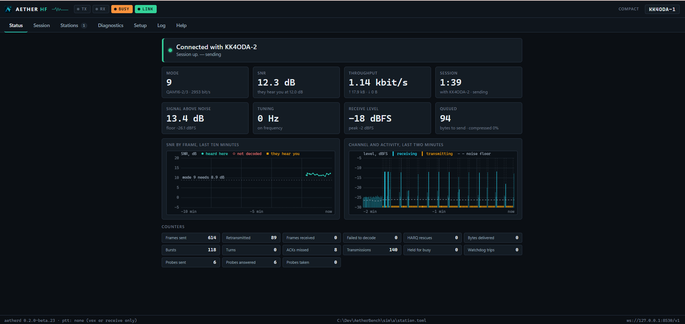
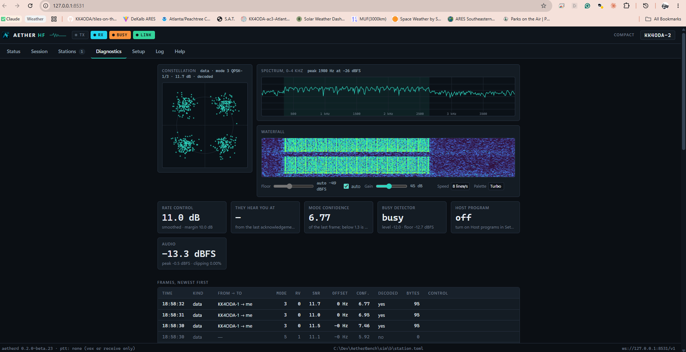

# Aether HF

[](https://github.com/KK4ODA/aether-hf/actions/workflows/ci.yml)
[](https://github.com/KK4ODA/aether-hf/releases)
[](#license)

An open-source HF data modem for amateur radio, built to do the job VARA HF does —
reliable ARQ links for Winlink, Pat, BBS and similar software over real, noisy, fading HF
channels — with a **publicly documented air interface**, a **VARA-compatible host
interface** so existing applications work unchanged, and a **headless core** that runs on a
Raspberry Pi gateway as happily as on a Windows desktop.

> **Status: beta — verified on the bench, first contacts on the air.**
> Signed builds ship from [Releases](https://github.com/KK4ODA/aether-hf/releases)
> (`0.2.0-beta.20` at the time of writing): a Windows installer, Linux packages and the
> standalone `aetherd` daemon for gateways, with in-place updates on a beta channel. The
> modem (3GPP LDPC, OFDM, selective-repeat ARQ with HARQ soft combining, rate control,
> compression) runs at 2300 Hz with 14 modes from BPSK 1/5 to 64-QAM 5/6, and at 500 Hz
> with 13 modes down to a *floor frame family* that is acquired at −12 dB and decoded at
> −11 dB SNR (3 kHz) and completes a session at −10 dB ([ADR-0009](docs/adr/0009-the-floor.md)).
> **Winlink Express, Pat and VarAC each complete a session at both ends of a simulated
> channel**, attachments byte-identical on arrival. Two on-air bugs have been found and fixed
> from a rig's scope; logged on-air sessions with other stations are what remains (Phase 6).
> Every performance figure in this repository comes from a committed benchmark curve in
> `bench/baselines/`. A **Test session** (Session → *Test session*) runs a fixed sequence
> against any listening station — a probe, a message, a file, a burst at every mode —
> records it, and Help → *Contribute* turns the recording into a report the project can
> replay: how every volunteer contact becomes a measurement.

## Screenshots

The station panel during a Test session on the bench — two daemons on one machine over
the simulated channel at 12 dB. The caller's Status tab: the readings, the SNR of every
frame with what the other station reports, and the channel's rhythm of bursts,
acknowledgements and this station's own transmissions:



The other station's Diagnostics tab while the file arrives: the last frame's constellation,
the spectrum, the waterfall, and every frame the receiver found:



## Getting it

* **Desktop:** download the installer for Windows, Linux or macOS from
  [Releases](https://github.com/KK4ODA/aether-hf/releases) and follow
  [`docs/user/install.md`](docs/user/install.md). The setup wizard finds the sound card and
  the rig, tests keying, and sets the transmit level; the settings are kept as *profiles*,
  one per radio or place, exportable as a file for another computer. The Windows installer is not yet
  Authenticode-signed, so SmartScreen will ask, and the macOS build (Apple Silicon) is
  unsigned and untested on a real Mac — the guide says how to open it; `SHA256SUMS` is
  beside every asset.
* **Host programs:** Winlink Express (Vara HF session, TNC at `127.0.0.1:8300`, auto-launch
  off) and Pat (`varahf`) talk to the daemon's VARA-compatible port. What each client sends,
  what is verified and what is not is in
  [`docs/spec/host-interfaces.md` §7](docs/spec/host-interfaces.md). The modem runs at
  2300 Hz or, for peer-to-peer contacts and VarAC, at **500 Hz** (`[radio]
  bandwidth`; `docs/spec/air-interface.md` §2.3) — both stations of a session use the same
  one. VarAC pings and connects to it at 500 Hz on the bench.
* **Gateway:** the `aetherd-…` archive and [`docs/user/gateway-kit.md`](docs/user/gateway-kit.md)
  (headless install, systemd unit, cross-compiling for ARM64). An Aether gateway must not be
  listed as a VARA gateway.
* **Updates:** the desktop application checks for a newer signed build on start (`[update]
  channel`: `stable`, `beta` or `nightly`) and keeps the previous installer for going back.

## Where things stand

A full technical audit was done on 2026-09-13 — read [`docs/AUDIT.md`](docs/AUDIT.md). In
short: the original prototype's DSP, FEC, sync, audio and protocol layers each had a
disqualifying defect, and its test suite had been relaxed until it passed. Every finding was
encoded as a strict `xfail` test and retired together with the module it documented as the
Phase 1 rewrite replaced it; the audit itself remains the record of why.

The plan is [`docs/ROADMAP.md`](docs/ROADMAP.md) (architecture, DSP decisions, protocol/API
design, testing strategy, release engineering, phased tasks) and the field requirements
distilled from how the community received Mercury, the other VARA alternative, in
[`docs/COMMUNITY-CONCERNS.md`](docs/COMMUNITY-CONCERNS.md).

| Phase | Scope | State |
|---|---|---|
| 0 — Audit & stabilization | tooling, strict tests, CI, calibrated simulator, ADRs | done |
| 1 — Core HF modem | LDPC (3GPP TS 38.212), OFDM TX/RX, sync, end-to-end loopback, benchmarks, golden vectors | done (Python model) |
| 2 — Link robustness | ARQ, rate control, HARQ-IR, low-SNR modes, PAPR, impulse noise | done (model) |
| 3 — Application integration | Rust core bit-exact with the model, `aetherd`, PTT/CAT, control API, VARA-compatible TCP, gateway kit | done; Pat and Winlink Express pass the bench, VarAC waits on a 500 Hz waveform |
| 4 — Desktop application | station panel, Tauri shell, setup wizard, diagnostics, accessibility | done; the three-ham usability test is open |
| 5 — Release infrastructure | one version number, installers that bundle the daemon, signed updates on three channels, SBOM, benchmark gate | done — betas flow, `0.2.0-beta.2` through `.20` |
| 6 — Field validation | recordings, replay regression tier, simulated channel, measured-vs-predicted tool, field protocol; then the air; then on-air crowdsourcing — a Test session every volunteer can run, whose sidecar the bench replays (P6-7) | **in progress**: tooling done, the Test session built (Session → *Test session*: probe, message, file, a burst at every mode, recorded; Help → *Contribute*), the air open (`field/LOG.md`) |
| 7 — The 500 Hz waveform and the link probe | the bandwidth P2P contacts are made in (VarAC's calling frequencies), the bandwidth in the connect handshake, an answer-only unattended mode, and a two-way SNR probe | **done on the bench**: the 500 Hz waveform (`[radio] bandwidth = 500`, `BW500`, answer-only), the probe (ADR-0006), and VarAC pinging and connecting over the simulated channel at 500 Hz; the air with a VarAC station remains. Phase 9 has begun: the rate controller climbs back faster after a failure (ADR-0007) and a session starts where the connect frames measured it (ADR-0008) — a 2 kB session at 12 dB in 15 s instead of 29. The 500 Hz air has its floor (ADR-0009): a frame family with an eight-symbol preamble and tenth-rate QPSK, acquired at −12 dB and decoded at −11 through the real modem, a session at −10 dB where nothing connected below −5.5 before |
| 9 — The modem's second rung | a faster start, modes below 200 bit/s, an audio-level A/B bench against VARA HF, the deferred pilot/prefix/2750 Hz experiments, time diversity — each with its curve | next, interleaved with 7 |
| 8 — Aether on a phone | the modem in a Pi-sized box the phone talks to over Bluetooth or Wi-Fi, then a phone app, then the modem inside the phone | back burner |
| 10 — Aether FM foundation | an FM PHY on the same link layer | back burner |

## Architecture in one paragraph

Application adapters (VARA-compatible TCP now; KISS/AGW later) sit on a PHY-agnostic link
layer (session, selective-repeat ARQ with HARQ-IR, rate control, compression) and a modem
framework (frame codec, scheduler, metrics), which drive a pluggable PHY (HF OFDM first, FM
later) over a hardware abstraction (audio, PTT, rig control, or the channel simulator). The
Python model in `model/` is the specification: it designs and validates the waveform and
generates the golden vectors the Rust core in `core/` is held to, bit-exactly, in CI. The
desktop shell in `app/` supervises the daemon and serves its panel (ADR-0001, ADR-0005).
Diagrams and rationale: [`docs/ROADMAP.md` §4](docs/ROADMAP.md#4-recommended-target-architecture).

## Repository layout

```
docs/          AUDIT.md · ROADMAP.md · COMMUNITY-CONCERNS.md · adr/ (decisions) · spec/ (public
               air interface, control API, host interfaces) · user/ (install, gateway kit,
               frequency plan, field-test protocol)
model/         Python reference model: aether_model/{channel,waveform,fec,phy,frame,link,hal} + tests/
core/          the shipped Rust workspace: aether-fec · aether-phy · aether-link · aetherd
app/           ui/ (the station panel, no build step) · src-tauri/ (the desktop shell)
field/         the field log and the recorded sessions that are now regression tests
deploy/        systemd unit for a gateway
tools/         benchmarks · vector generators · release.py · compare_air.py · bench_gate.py
bench/         committed baseline curves, including the release gate's
vectors/       golden test vectors (TX bit-exact, RX must decode)
```

## Working on it

The model needs Python ≥ 3.12 and [uv](https://docs.astral.sh/uv/) (`pip install uv`
works too; then use `python -m uv`). The core needs a stable Rust toolchain; the shell
additionally needs [Tauri's prerequisites](https://tauri.app/start/prerequisites/).

```bash
uv sync                      # creates .venv with numpy/scipy + dev tools
uv run pytest                # strict suite; `-m "not slow"` for the quick set
uv run ruff check . && uv run ruff format --check . && uv run mypy
uv run pre-commit install    # optional: run the same checks on every commit

cd core && cargo test --release --workspace        # acquisition is ~20x slower in debug
cargo clippy --all-targets --all-features -- -D warnings
```

`aetherd --config <file> --dry-run` runs the daemon with no radio; two daemons joined by
`[sim]` make a bench with no radio either (`docs/user/field-test.md` §1). CI runs all of the
above on Windows and Ubuntu and regenerates every cross-validation vector, failing on drift:
a mismatch means the core is wrong, never that the vectors are stale.

Conventions that matter:

* **SNR is always referenced to a 3 kHz noise bandwidth**; Doppler spread is the ITU-R
  F.1487 2σ value. `model/aether_model/channel.py` is calibrated to both and its tests are
  the guarantee behind every benchmark number.
* Minimum usable SNR (FER ≤ 10 %, random CFO and sample-rate offset), 2300 Hz: BPSK 1/5 at
  −5.2 dB on AWGN and −0.3 dB on ITU Poor, QPSK 1/2 at +1.0 / +6.0 dB, 16-QAM 1/2 at
  +6.0 / +12.5 dB, 64-QAM 5/6 at +16.9 dB on AWGN. 500 Hz: the floor frame at QPSK 1/10
  reaches −12.2 dB on AWGN and −2.0 dB on Poor, QPSK ½ at −5.2 dB. The whole table, per
  channel class, is in [`bench/README.md`](bench/README.md).
* **No test threshold is ever relaxed to make a suite pass.** A known defect gets an
  `xfail(strict=True)` that names the finding; a target that genuinely changes gets an ADR.
* Numbers about the waveform come from `model/aether_model/waveform.py`, never from prose;
  the public [air-interface spec](docs/spec/air-interface.md)'s tables are generated from it.

## Contributing

See [`CONTRIBUTING.md`](CONTRIBUTING.md) for the rules and
[`docs/MAINTAINING.md`](docs/MAINTAINING.md) for how pull requests are reviewed. Issues and
pull requests are welcome; the roadmap is the queue, and the most useful contribution right
now is an on-air session logged the way [`docs/user/field-test.md`](docs/user/field-test.md)
describes. Protocol and DSP decisions go through short ADRs in `docs/adr/`. The
[code of conduct](CODE_OF_CONDUCT.md) is the hobby's own: be excellent to each other.

## Prior art and independence

Aether HF is designed from public standards and open literature (3GPP TS 38.212 LDPC,
IEEE 802.11 LDPC, ITU-R F.1487 channel models, MIL-STD-188-110, OFDM synchronization
literature) and open implementations we can learn from (codec2/FreeDV data modes, FreeDATA,
ARDOP). It does not copy or reverse-engineer VARA; the host-interface compatibility targets
VARA's *published* TCP command set only, and Aether frames are not compatible with VARA's on
the air.

## Support

Aether HF is free software and stays that way. The bench it is measured on — radios,
interfaces, the hours on the air — is paid for by its author. If the modem is useful to
you, a contribution through
[PayPal](https://paypal.me/facundofern)
(also the *Sponsor* button above) helps keep it on the air. An on-air report is worth as
much.

## License

Dual-licensed under **MIT OR Apache-2.0** — see [`LICENSE-MIT`](LICENSE-MIT) and
[`LICENSE-APACHE`](LICENSE-APACHE). Contributions are accepted under the same terms.

## Authors

KK4ODA — author. Development is done with Claude Code as a co-developer; all design
decisions and on-air responsibility remain with the licensed operator.
