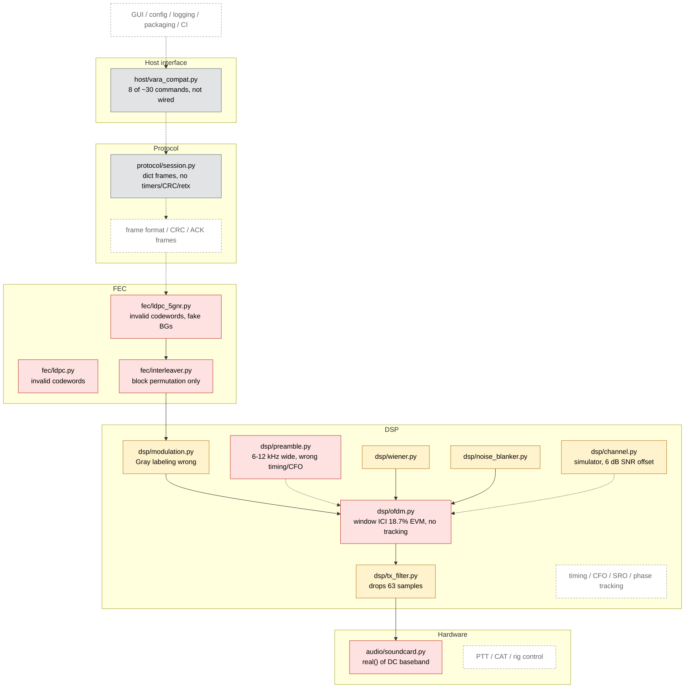
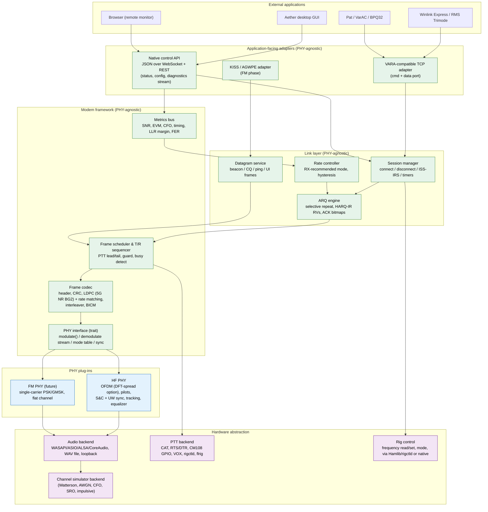

# Aether HF — Development Roadmap

**Version:** 0.1 (2026-09-13) · **Companion document:** [`AUDIT.md`](AUDIT.md) (detailed evidence)
**Goal:** turn Aether HF into a robust, open-source, VARA-HF-class ARQ modem for amateur HF,
shipped as professionally maintained Windows-first desktop software, with an architecture
that later carries an Aether FM PHY without duplicating the application.

---

## 1. Executive assessment

- **State of the repository:** 3 863 lines of Python across 26 files, 4 commits, no build
  system, no license file, no CI, no spec document. Every signal-chain layer is present as a
  module and every one of them is non-functional on a real channel (audit §2). No end-to-end
  path exists from bytes to audio and back. Nothing has been on the air.
- **Test evidence:** none. The 7/7 "conformance" result was produced by relaxing thresholds
  (e.g. FER < 0.10 → < 0.95) and by asserting detection without correctness. Both FEC
  encoders emit invalid codewords 100 % of the time; the HARQ test shows FER = 1.00 at
  every round and still passes.
- **Can it evolve into the target product?** The *design intent* can; the *code* mostly
  cannot. The right move is a **reference-model rewrite** in Python (keeping the module
  decomposition, the channel-simulator skeleton, the mode-table data structure, the
  constellation code), followed by a **production core** in a compiled language driven by
  golden test vectors from the model. There is very little working code to preserve, so
  this is cheaper than incremental patching.
- **Biggest strategic risks:** (1) shipping unverified performance claims again;
  (2) picking waveform parameters without a calibrated simulator; (3) building a GUI before
  a headless modem works; (4) FEC and sync — the two hardest DSP pieces — being under-scoped.
- **Biggest opportunities:** a *public* air-interface specification (also an FCC §97.309(a)(4)
  requirement in the US), a VARA-compatible host API that lets Winlink Express / Pat / VarAC /
  BPQ32 work day one, real HARQ-IR via 5G-NR rate matching, and a web-technology UI that
  serves both the desktop app and remote/headless operation.

---

## 2. Current architecture



Solid arrows are the only connections that exist in code (and only inside individual test
functions). Dashed arrows are connections the design implies but the code does not make.

---

## 3. Major technical deficiencies and risks

Ranked by impact on the goal, with the audit reference.

| # | Deficiency | Impact | Audit ref |
|---|---|---|---|
| 1 | No working FEC (both encoders invalid; decoder ~1 s per short block) | Nothing below ~10 dB SNR is possible; HARQ, rate adaptation and all low-SNR claims are void | §2 `fec/*` |
| 2 | No synchronization (timing, CFO, SRO, phase) and a preamble 4× wider than the channel | Cannot acquire a real signal | §2 `preamble.py` |
| 3 | Audio path collapses the complex baseband; no passband placement | Cannot go on the air at all | §2 `soundcard.py` |
| 4 | OFDM window self-inflicts 18.7 % EVM | Caps the link at ~QPSK regardless of everything else | §2 `ofdm.py` |
| 5 | No frame format, CRC, ACK frames, ARQ timers, retransmission | No protocol exists to test | §2 `session.py` |
| 6 | Simulator mis-calibrated (SNR ref, Doppler σ, per-block normalization, no continuity, no CFO/SRO) | Every future number would be wrong by 3–6 dB | §4 |
| 7 | Test suite asserts nothing meaningful | Regressions invisible; false confidence | §3 |
| 8 | README claims unmeasured performance | Credibility risk for an open-source project | §2 README |
| 9 | Host API implements a fraction of VARA's public command set with wrong `CONNECT` syntax | Winlink Express / Pat cannot connect | §2 `vara_compat.py` |
| 10 | No build/packaging/license/CI | Cannot be installed, contributed to, or released | §2 missing |
| 11 | Pure-Python per-element DSP | Not real-time even for a prototype (150 s test run) | throughout |
| 12 | Mode table not derived from waveform (rates off by 2–2.5×; 3 000 Hz vs 2 300 Hz) | Spec/implementation inconsistency | §2 `constants.py` |

---

## 4. Recommended target architecture

### 4.1 Layering



Green = reused unchanged by Aether FM. Blue = per-PHY. Purple = hardware.

### 4.2 Process model

- **`aetherd` — headless modem daemon.** Owns audio, PTT, PHY, link layer, and the two
  network surfaces (VARA-compatible TCP; native WebSocket/REST). Runs as a console process,
  a Windows service, or embedded in the desktop app. Real-time threads: audio callback →
  lock-free ring → DSP worker; separate protocol thread; network threads.
- **Desktop GUI — separate process** (Tauri shell around a web front-end) talking to
  `aetherd` over the native API. The same front-end is served by `aetherd` for remote/headless
  monitoring. A GUI crash can never stop a transmission mid-frame or leave PTT keyed.
- **Python reference model — not shipped.** Bit-exact model of the PHY/codec used to design
  the waveform, generate golden vectors, and run the benchmark suite.

### 4.3 Language and stack (decision required — see ADR-0001 in Phase 0)

| | Python-only product | **Recommended: Python model + Rust core + Tauri GUI** | C++ core + Qt |
|---|---|---|---|
| Time to first on-air modem | fastest | model in Python first (same speed), port later | slower |
| Real-time robustness on Windows | fragile (GIL, GC, PyInstaller AV false positives) | excellent | excellent |
| Installer size / start-up | 150–250 MB, slow | ~10–20 MB, instant | ~30 MB |
| Signed auto-update | tufup (TUF), works but DIY | Tauri updater plug-in (Ed25519-signed, NSIS/MSI) built in | WinSparkle / Velopack |
| Cross-platform later | yes | yes (cpal, serialport, hidapi, Tauri) | yes |
| Contributor pool (ham DSP) | largest | growing; DSP crates (rustfft, num-complex) mature | large |
| Reuse of current code | design only | design + model | design only |

**Decision (2026-09-13, ADR-0001): Rust core + Tauri GUI, Python reference model.**
Keep Python as the *reference model and benchmark harness* (Phases
0–2 do all DSP design there), and build the shipped product as a **Rust workspace**
(`aether-fec`, `aether-phy-hf`, `aether-link`, `aether-modem`, `aether-hal`, `aether-api`,
`aetherd`) with a **Tauri v2** desktop shell. Port module-by-module against golden vectors
so the two never diverge. If you prefer to stay Python-only, the model *is* the product:
add a C/Rust extension for the LDPC decoder (PyO3), PySide6 for the GUI, PyInstaller +
Inno Setup for packaging and `tufup` for updates — the roadmap phases are identical;
only Phase 4/5 tooling changes. This is the one decision to confirm before Phase 1
implementation starts; Phase 0 is unaffected by it.

### 4.4 Proposed repository layout

```
aether-hf/
  docs/            spec/ (air-interface, control-api, host-interfaces), adr/, dev/, user/
  model/           Python reference model + benchmarks (evolves from aether_hf/)
  core/            Rust workspace (crates above)
  app/             Tauri desktop app (TypeScript front-end shared with remote UI)
  vectors/         golden test vectors (bits ↔ audio, per mode, versioned)
  tools/           benchmark runner, vector generator, audit probes
  .github/         workflows (ci, release, nightly), ISSUE_TEMPLATE, PULL_REQUEST_TEMPLATE
```

---

## 5. DSP / modem assessment and recommendation

### 5.1 Is OFDM the right waveform?

| Criterion | OFDM (pilot-aided) | Single-carrier serial-tone (MIL-STD-188-110-style, DFE) | DFT-spread OFDM / SC-FDE |
|---|---|---|---|
| Multipath 2–6 ms | CP absorbs it; per-carrier 1-tap EQ | needs 10–15-tap adaptive DFE at 2 400 Bd | CP + FD equalizer, same as OFDM |
| Doppler 1–2 Hz (Poor) | ICI ≈ fd/Δf ≈ 2–5 %: acceptable | best (no ICI concept) | same as OFDM |
| Flutter 10 Hz | poor (ICI 20–30 %) | degraded but usable | poor |
| PAPR / average TX power at fixed PEP | 8–10 dB → ~3–4 dB less average power than SC | 3–5 dB with RRC | 5–7 dB |
| Channel estimation | trivial (pilots) | training-sequence + tracking | pilots/UW, same as OFDM |
| Implementation & test complexity | lowest; open references (codec2 OFDM modes) | highest | moderate |
| Open prior art | codec2/FreeDV, FreeDATA | MIL-STD-188-110, STANAG 4285/4539 (public standards) | LTE uplink (public) |

**Recommendation:** keep OFDM for v1 — it is the fastest path to a working, benchmarkable,
publicly documented link and there are open on-air-proven references to compare against.
Two deliberate hedges: (a) run a **PAPR study in Phase 2** (clip-and-filter, tone
reservation, and DFT-spreading through a saturating-PA model) and adopt DFT-spread OFDM
if it buys ≥ 2 dB of average power; (b) keep the PHY behind a trait so a serial-tone PHY
could be added as "HF PHY v2" if benchmarks under Poor/flutter show a real gap. The
current code's *strategy* was defensible; its *parameters and implementation* were not.

### 5.2 Waveform starting point (to be finalized by simulation in Phase 1)

| Parameter | Proposal | Rationale |
|---|---|---|
| Audio I/O | 48 kHz (accept 44.1/96) | universal on Windows |
| Internal baseband | complex, 8 kHz, centre 1 500 Hz (configurable) | 6:1 integer resampling; 3 kHz channel; VARA-like placement |
| Subcarrier spacing | ≈ 40 Hz (N=200 at 8 kHz), Tu = 25 ms | ICI ≤ 5 % at 2 Hz; symbol long enough for cheap CP |
| Cyclic prefix | 6 ms (48 samples) → Ts = 31 ms, 32 Bd | covers ITU Poor (2 ms) and NVIS (up to 7 ms with extended CP option) |
| Carriers | 2 300 Hz: 57 (2 280 Hz); 2 750 Hz: 68; 500 Hz: 12 | US bandwidth limit now 2.8 kHz; VARA offers 500/2300/2750 |
| Pilots | comb every 4th carrier incl. both edges + full pilot symbol every 8th symbol | 2-D interpolation with no extrapolation |
| Preamble | 2 identical PN OFDM symbols on even carriers (Schmidl–Cox timing + fractional CFO) + 1 PN unique-word symbol whose index is the header (integer CFO, frame type, mode) — PN, never Zadoff–Chu (chirps confuse time and frequency) | ±250 Hz acquisition without CAT; deterministic frame timing |
| Windowing | proper raised-cosine with overlap-add (symbol extended by taper) + polyphase TX filter | spectral mask without ICI |
| Modulations | BPSK, QPSK, 8-PSK, 16-QAM, 64-QAM (Gray-labelled, BICM) | 32/128/256-QAM are not realistic on HF fading channels |
| FEC | 3GPP TS 38.212 LDPC **BG2** (K ≤ 3 840, rates 1/5 … 8/9) with circular-buffer rate matching, RV0–3 | one public code family covers all rates *and* gives HARQ-IR for free; Sionna/py3gpp as oracles. Fallback: IEEE 802.11n codes (648/1296/1944) + a PEG-designed low-rate code |
| CRC | CRC-16 header, CRC-24 payload before LDPC (5G style) | decode verification + false-decode floor < 1e-7 |
| Interleaver | row/column across the whole frame (time × frequency) + BICM bit interleaver | real burst/fade spreading |
| Low-SNR modes | BPSK R=1/5; BPSK R=1/5 + 4× spreading ("robust") | honest floor: ≈ −5 dB (3 kHz, Poor) at ~300 bps, ≈ −8 to −10 dB at ~80 bps. Drop the DSSS/FSK "emergency" concept |
| Sync tracking | SRO from pilot phase slope; phase from pilots per symbol; timing re-lock per frame | sound cards differ by ±100–200 ppm |
| TX envelope | preamble PAPR ≤ data PAPR; constant average power across preamble / data / ACK; soft ramp-up and ramp-down; no level step between frame parts | field complaint about Mercury: ALC spikes at TX start (see `COMMUNITY-CONCERNS.md` #8) |

Raw-rate sanity, computed by `model/aether_model/waveform.py` from these defaults (57 carriers,
15 comb pilots, 42 data, 32.3 Bd, one pilot symbol in eight): QPSK ½ ≈ 1.19 kbps,
16-QAM ¾ ≈ 3.6 kbps, 64-QAM ⅚ ≈ 5.9 kbps before framing/ARQ overhead (×1.19 for 2 750 Hz) —
the same rate class as VARA's public figures. The 25 % comb-pilot overhead is deliberate
for Poor-channel tracking; a sparser scattered grid is a Phase 2 experiment.

### 5.3 Protocol (link layer)

- **Roles:** ISS/IRS with explicit `BREAK` turnaround; deterministic slot timing per mode
  so ACK expectations are exact.
- **Connect:** `CONNECT_REQ(src, dst, session-id, capabilities, bandwidth)` →
  `CONNECT_ACK(level, guard)`; callsigns in clear in every connect/ID frame (regulatory ID).
- **Data:** selective-repeat window 4–8 frames, 8-bit sequence numbers, per-frame CRC,
  ACK carries a bitmap + **receiver-recommended level** (receiver measures LLR margin /
  EVM / SNR — it knows best) + HARQ hint (NAK-near-miss → send RV1/RV2 rather than RV0).
- **Rate control:** hysteresis on RX-recommended level; step-down fast, step-up after N
  consecutive clean frames; never oscillate more than one level per ACK.
- **Robustness:** ACK frames use the most robust mode with a short preamble; connect
  attempts escalate mode; link-loss after M consecutive timeouts; idle keep-alive.
- **Datagram service:** beacon / CQ / ping (link-quality report) / UI frames — needed for
  VarAC-style workflows, busy-channel etiquette, and later KISS/AX.25 on FM.
- **Compression:** negotiated payload compression (zstd or LZMA dictionary) as a Phase 3
  option; Winlink traffic is text-heavy.

---

## 6. Protocol / API recommendations

Three independently versioned documents, each with its own conformance vectors:

| Document | Scope | Consumers |
|---|---|---|
| `docs/spec/air-interface.md` | PHY (waveform, preamble, pilots, modes), frame formats, FEC/rate matching, ARQ state machines, timers. **Public** (FCC §97.309(a)(4)). | other implementers, regulators |
| `docs/spec/control-api.md` | Aether-native JSON over WebSocket (+ REST for one-shots): `status`, `config get/set`, `connect`, `disconnect`, `send`, `metrics` stream (SNR, CFO, constellation, spectrum), `devices list`, `ptt test`, `audio calibrate`, auth token for non-loopback binds. PHY-agnostic; HF/FM differ only in the mode table. | GUI, remote web UI, third-party tools, tests |
| `docs/spec/host-interfaces.md` | Adapters: **VARA-compatible TCP** (command + data ports; full public command set: `MYCALL`, `LISTEN`, `CONNECT src dst [via]`, `DISCONNECT`, `ABORT`, `COMPRESSION`, `BW500/2300/2750`, `VERSION`, `PUBLIC`, `CWID`, `CHAT`, `PING`, `CQFRAME`, `TUNE`, `CLEANTXBUFFER`, `WINLINK SESSION`, `P2P SESSION`; events `OK/WRONG/BUFFER n/CONNECTED/DISCONNECTED/PENDING/CANCELPENDING/PTT ON|OFF/BUSY ON|OFF/IAMALIVE/REGISTERED`), later **KISS** and **AGWPE** for the FM/packet use-case. | Winlink Express, RMS Trimode, Pat, VarAC, BPQ32 |

Rig control is *not* an application-facing API; it is a HAL backend (Hamlib `rigctld`
client, `flrig` XML-RPC, native CAT for a few very common radios, serial RTS/DTR, CM108,
VOX). Virtual COM/serial host interfaces are not needed for HF (nothing in the Winlink
ecosystem uses them for VARA-class modems); revisit for FM/KISS.

---

## 7. Testing and benchmarking strategy

Principle: **every DSP or protocol change must move a number on a committed curve, or it
does not merge.**

### 7.1 Test tiers

| Tier | Tool | Runs | Examples |
|---|---|---|---|
| Unit | pytest (model), `cargo test` (core) | every push, < 2 min | LDPC encode → H·c = 0 for 1 000 random blocks; Gray property; CRC vectors; interleaver bijection; resampler passband ripple; frame codec round-trip; ARQ state machine transitions |
| DSP regression | pytest + golden vectors in `vectors/` | every push | bit-exact TX waveform per mode; RX from recorded WAV yields expected bits; sync timing error ≤ 1 sample and CFO error ≤ 0.5 Hz at 0 dB across ±250 Hz and ±200 ppm SRO |
| Protocol | two in-process modems over the simulator | every push | connect / transfer 10 kB / disconnect on Good/Moderate/Poor at fixed SNRs; no PTT stuck; retransmission counts bounded |
| Benchmark | `tools/bench` → CSV + plots, committed baselines | nightly + on demand | FER-vs-SNR per mode per channel; throughput-vs-SNR; connect probability; latency |
| Hardware loop | virtual audio cable / two sound cards / SDR loop | manual, pre-release | real audio path, PTT timing, level calibration |
| Field | recorded on-air sessions saved as WAV + metadata | per milestone | replayable into the regression tier |

### 7.2 Impairment set (all in the simulator, all seedable)

AWGN · ITU-R F.1487 mid-latitude Good/Moderate/Poor (0.5 ms/0.1 Hz, 1 ms/0.5 Hz,
2 ms/1 Hz) · Flutter (0.5 ms/10 Hz) · NVIS (7 ms/1 Hz) · Rician K=10 dB · CFO ±250 Hz
static and ±5 Hz/s drift · SRO ±200 ppm · phase noise · Middleton class-A impulsive ·
adjacent-channel interferer (SSB voice/CW carrier at −6 … +20 dB) · saturating PA / ALC
model · deliberate packet loss & corruption at the frame layer · audio clipping / DC offset.

### 7.3 Metrics (definitions live in `docs/dev/metrics.md`)

BER · FER (after CRC) · packet success rate · connection-establishment probability vs SNR ·
effective throughput (bytes/s incl. ACKs and turnarounds) · latency (first byte, ACK
round-trip) · retransmissions per kB · **minimum usable SNR** (SNR at FER = 10 % per mode)
· robustness vs CFO/SRO (SNR penalty at 0.5 dB steps) · PAPR / average-power efficiency ·
CPU time per second of audio. **All SNRs referenced to 3 kHz noise bandwidth.**

### 7.4 Acceptance gates (initial targets; revised as data arrives)

- QPSK R=½ AWGN: FER < 1 % at ≤ +3 dB. BPSK R=1/5 AWGN: FER < 10 % at ≤ −7 dB.
- ITU Poor: at least one mode with FER < 10 % at 0 dB; throughput ≥ 300 bps at +5 dB.
- Sync: acquisition probability > 99 % at the lowest mode's threshold, CFO ±250 Hz.
- Protocol: 10 kB transfer completes on Poor at +5 dB in ≤ 1.5× ideal air time.

---

## 8. UI / UX improvements

- **Setup wizard** (first run): callsign → audio devices (auto-suggest by name: Digirig,
  SignaLink, IC-7300/7610/705, FT-891/991, "USB Audio CODEC") → PTT method with a **test
  key** (measures actual TX-on delay via audio loop when possible) → rig control probe
  (scan COM ports, try Hamlib backends / rigctld / flrig) → **level calibration**
  (RX: show headroom/clipping meter while user adjusts; TX: transmit tune tone, user sets
  drive for ALC zero, wizard stores level) → loopback self-test → done.
- **Main window:** connection panel (my call, remote call, bandwidth, connect/disconnect/
  abort), state banner (Listening / Connecting / Connected ISS/IRS / Busy channel /
  Device error), live meters (RX level, SNR, CFO, mode, throughput, retries, buffer),
  waterfall/spectrum with the passband marked, constellation, TX/RX activity LEDs.
- **Diagnostics view:** LLR-margin history, timing/SRO estimates, PTT timeline,
  frame log (type, seq, mode, CRC ok), "Save diagnostic bundle" (config with secrets
  scrubbed, last 10 minutes of log, last 30 s of RX audio, version/OS/device info).
- **Error messages** written for operators ("The sound device *USB Audio CODEC* was
  unplugged. Reconnect it or choose another in Settings → Audio."), never stack traces.
- **Settings profiles** per radio/site (portable JSON), import/export.
- **Accessibility:** full keyboard navigation, labelled controls, high-contrast theme,
  no information conveyed by colour alone.
- **Logging:** structured (JSON lines), rotating, levels; correlation IDs per session.

---

## 9. Build, installer, CI/CD and automatic updates

| Concern | Recommendation |
|---|---|
| Versioning | SemVer; `vX.Y.Z` tags; Conventional Commits; `git-cliff` (Rust) / `release-please` for changelog |
| CI | GitHub Actions matrix (windows-latest, ubuntu-latest, macos-latest): lint (ruff/clippy), unit + DSP regression, protocol tests, benchmark smoke; cache `cargo`/`pip` |
| Reproducible builds | pinned toolchains (`rust-toolchain.toml`, `uv.lock`/`requirements.lock`), locked npm deps, SBOM via `cargo auditable` / `cyclonedx` |
| Installer | Tauri bundler → NSIS `.exe` (per-user install, no admin) + MSI; Linux `.deb`/AppImage; macOS `.dmg` later. Clean uninstall keeps `%APPDATA%\AetherHF` unless user opts to remove |
| Settings migration | `config.json` with `schema_version`; ordered migration functions; backup previous file on every upgrade |
| Signing | Ed25519-signed update manifests (Tauri updater / minisign) from day one; Windows Authenticode via **SignPath.io free OSS signing** or Azure Trusted Signing when eligible; until then document the SmartScreen warning |
| Auto-update | Tauri v2 updater plug-in: checks `https://…/releases/<channel>/latest.json`, verifies signature, downloads, prompts, installs, restarts. Python alternative: `tufup` |
| Rollback | keep previous installer in `%LOCALAPPDATA%\AetherHF\rollback\`; "Restore previous version" in Help menu; updater refuses to install if post-install self-test (daemon starts, audio enumerates) fails |
| Channels | `nightly` (every main commit, prerelease, 7-day retention), `beta` (`vX.Y.Z-beta.N` tags), `stable` (`vX.Y.Z`); channel selectable in Settings; stable never auto-jumps to beta |
| Release gate | tag → CI must pass all tiers incl. benchmark regression check (no curve worse by > 0.3 dB) → build → sign → GitHub Release with notes + SHA-256 + SBOM |

---

## 10. Documentation and open-source development

- `README.md` rewritten to state actual status; performance claims only with a link to the
  benchmark page that generated them.
- `docs/spec/` (three specs above) versioned with the code; `docs/adr/` (architecture
  decision records; ADR-0001 = language/stack, ADR-0002 = waveform parameters,
  ADR-0003 = FEC family); `docs/dev/` (build, test, benchmark, metrics definitions,
  coding standards); `docs/user/` (install, wizard, Winlink/Pat setup, troubleshooting).
- `CONTRIBUTING.md`, `CODE_OF_CONDUCT.md`, `SECURITY.md`, issue templates (bug report
  with diagnostic bundle attachment, feature request, on-air report with WAV), PR template
  with a "benchmark delta" section.
- Branching: trunk-based (`main` protected, short-lived feature branches, squash merges,
  required CI). Releases cut from tags; hotfix branches from tags when needed.
- Standards: ruff + mypy (model), clippy + rustfmt (core), eslint/prettier (app),
  pre-commit hooks, `cargo deny` for licenses.
- License: pick the dual **MIT OR Apache-2.0** the README already claims and add both files.
  Implement FEC from public standards (3GPP/IEEE) rather than importing LGPL code.
- `CLAUDE.md` at repo root describing layout, how to run tests/benchmarks, and the rule
  "no threshold changes in tests without an ADR".

---

## 11. Architecture for eventual Aether FM

The layering in §4.1 already isolates the PHY. Decisions to make **now** so FM is cheap later:

1. **PHY trait, not PHY constants.** `Phy::modes()`, `Phy::modulate(frame, mode)`,
   `Phy::feed(samples) -> events`, `Phy::sync_state()`. No global `FFT_SIZE`; the link layer
   reads frame durations and turnaround from the mode table.
2. **Sample-rate-agnostic HAL.** FM PHYs via a 9 600-capable data port want 48 kHz
   processing and ±6 kHz bandwidth; the HAL must not assume 8 kHz baseband.
3. **Timers from the mode table.** ACK timeouts, guard, max frame length are per-PHY data.
4. **Datagram service in the link layer** so an FM PHY can carry AX.25/KISS UI frames.
5. **Separate crates** (`aether-phy-hf`, later `aether-phy-fm`) with identical test
   harness contracts (golden vectors, simulator backend).
6. **Channel simulator with pluggable impairments** — FM needs flat channel + FM
   deviation/pre-emphasis models, not Watterson.

Aether FM PHY sketch: single-carrier QPSK/16-QAM (or GMSK for narrow) at 4.8–19.2 kBd
through the data jack, RRC pulse shaping, simple training-based equalizer, same preamble
philosophy (repeated block + UW), same 5G-NR LDPC/rate matching. Everything above the PHY
is reused, including the VARA-compatible adapter (with the FM command variants) and KISS.

---

## 12. Additional features worth considering

| Feature | Value | Phase |
|---|---|---|
| Headless daemon + web UI (already implied by §4.2) | remote stations, Raspberry Pi gateways, RMS operators | 3–4 |
| Built-in channel simulator as an audio backend | test Winlink/Pat end-to-end with no radio; demo mode; CI | 1 |
| Session audio capture + replay (`.wav` + JSON metadata) | every field failure becomes a regression test | 1 |
| Standard diagnostic bundle | supportable software | 4 |
| Link-quality ping / beacon with SNR report both ways | VarAC-style QSO tools, propagation checks | 3 |
| Busy-channel detector (energy + structure) | etiquette, required by Winlink Express (`BUSY`) | 3 |
| CW ID option and clear-text callsigns in headers | regulatory compliance, no-argument identification | 3 |
| Digirig / CM108 / IC-7300-class auto-detection profiles | zero-config for the most common hardware | 4 |
| Portable profiles (JSON) | club stations, emcomm go-kits | 4 |
| Winlink gateway mode notes (RMS Trimode compatibility) | more Aether-capable gateways = more usable network | 3/6 |
| PAPR-aware "average power" meter | operators see the real advantage of drive settings | 2 |
| Spectrum occupancy log | choosing frequencies; emcomm planning | 4+ |
| Modem-to-modem telemetry (SNR both ways in ACKs) | already part of ARQ design; expose in UI | 2 |
| Public gateway registry + beacon/CQ discovery frames | answers "where are the RMSs?" — the top adoption concern in the Mercury thread | 3 |
| Packaging for ham Linux distros (`.deb`, ARM64, LiaisonOS/DragonOS inclusion) | gateways run on Pis; distros are a free distribution channel | 3–5 |

Not recommended now: encryption (illegal on amateur bands in most jurisdictions), mesh/relay,
mobile apps.

---

## 13. Prioritized implementation roadmap

Dependencies are listed by task ID. "Files" refer to today's layout; the model will move to
`model/` during Phase 0.

### Phase 0 — Audit and stabilization (weeks 1–3)

| ID | Task | Depends on |
|---|---|---|
| P0-1 ✅ | Repo hygiene: `pyproject.toml` (uv/pip), `requirements.lock`, `LICENSE-MIT` + `LICENSE-APACHE`, `ruff`, `mypy`, `pre-commit`, `pytest` config, `.editorconfig` | – |
| P0-2 ✅ | GitHub Actions CI (Windows + Linux): lint + pytest; badge in README | P0-1 |
| P0-3 ✅ | Replace test suite: convert both test files to strict pytest; mark known-broken behaviour `xfail(strict=True)` with the audit finding as reason; delete relaxed thresholds | P0-1 |
| P0-4 ✅ | Rewrite README honestly; move audit + roadmap under `docs/`; add `CLAUDE.md`, `CONTRIBUTING.md`, issue/PR templates | – |
| P0-5 ✅ | ADR-0001 language/stack decision; ADR-0002 waveform parameter targets; ADR-0003 FEC family | P0-4 |
| P0-6 ✅ | Fix channel simulator: continuous low-rate fading with state, Doppler 2σ, no per-block normalization, correct F.1487 table, 3 kHz SNR reference, add CFO/SRO/adjacent-channel/PA-clip impairments; statistical unit tests (Rayleigh amplitude CDF, Doppler spectrum width, SNR calibration) | P0-3 |
| P0-7 ✅ | Delete `fec/ldpc.py`, stream-of-consciousness comments; regenerate `constants.py` from ADR-0002 | P0-5 |

Risks: scope creep into Phase 1. Acceptance: CI green on a suite where every assertion is
meaningful; simulator calibration tests pass; README makes no unmeasured claim.
Files: everything under `aether_hf/tests`, `dsp/channel.py`, `constants.py`, README, new `docs/`, `.github/`.

### Phase 1 — Core HF modem (weeks 3–12)

| ID | Task | Depends on |
|---|---|---|
| P1-1 ✅ | **FEC:** TS 38.212 BG2 LDPC encoder (double-diagonal + back-substitution), circular-buffer rate matching RV0–3, vectorized layered min-sum decoder (numpy; numba/Rust later); validate against Sionna/py3gpp; BLER curves for K ∈ {200, 500, 1 000, 2 000, 3 800} at rates 1/5…5/6 | P0-6 |
| P1-2 ✅ | **Constellations:** correct Gray labels, vectorized max-log LLR demapper with noise-variance input; tests for Gray property and LLR sign | P0-3 |
| P1-3 ✅ | **Frame codec:** header/CRC-16/CRC-24, row-column interleaver + BICM, mode table derived from waveform; spec §frames drafted alongside | P1-1, P1-2 |
| P1-4 ✅ | **OFDM TX:** carrier map with edge pilots, scattered pilot grid, windowed OLA, TX filter, passband placement, 8 k → 48 k polyphase; noiseless EVM test = 0 | P0-7 |
| P1-5 ✅ | **Preamble & sync:** band-limited S&C pair + UW; detector with fine timing (±1 sample) and CFO (fractional + integer) to ±0.5 Hz at 0 dB across ±250 Hz; SRO estimation; false-alarm rate test on noise/voice | P1-4 |
| P1-6 ✅ | **OFDM RX:** streaming demodulator with timing/CFO/SRO/phase tracking, LS + 2-D interpolation equalizer, noise-variance estimate feeding LLRs | P1-5 |
| P1-7 ✅ | **End-to-end PHY loopback:** bytes → WAV → bytes at every mode through the simulator; benchmark runner producing FER/throughput-vs-SNR CSV + plots; baselines committed | P1-3, P1-6 |
| P1-8 ✅ | **Audio HAL (model):** sounddevice backend + WAV backend + simulator backend, ring-buffered streaming, device enumeration, level metering; loopback via virtual cable on Windows | P1-4 |
| P1-9 ✅ | **Golden vectors v0:** per-mode TX waveforms and RX expectations in `vectors/` | P1-7 |

Risks: LDPC decoder speed in Python (mitigate: vectorize, numba); sync under Poor+CFO+SRO
combined. Acceptance: gates in §7.4 for AWGN; Poor channel FER curves exist for every mode.
New: `model/aether_model/{fec,phy,frame,hal}`, `tools/bench`, `vectors/`.

**Status (2026-09-13): Phase 1 complete in the model.** AWGN thresholds (FER < 5 %, 3 kHz,
with random CFO/SRO): BPSK ½ −1 dB, QPSK ½ +2, 16-QAM ½ +7, 64-QAM ⅚ +17 dB
(`bench/baselines/phy_fer_phase1_uw.csv`, summarised in `bench/README.md`). Acquisition
was reliable to ≈ −2 dB with the Phase 1 preamble; P2-3 (branch `phase-2`) replaced it
with a matched-filter bank and chip-signalled mode — acquisition is now 100 % at −5 dB and
87 % at −7 dB, and the BPSK 1/5 code (≈ −6 dB) is the floor. ADR-0002 carries the
amendments (PN preamble sequences, layouts, mode table, P2-3 air interface).

### Phase 2 — Link robustness and performance (weeks 10–20)

| ID | Task | Depends on |
|---|---|---|
| P2-1 ✅ | ARQ engine + session FSM (PHY-agnostic, event-driven `aether_model/link/`): selective repeat, ACK bitmap, RX-recommended mode, HARQ-IR combining with the RV carried in the pilot chips and the sequence number inferred for failed frames, connect/turn/disc handshakes, timers, BREAK, keep-alive. Two harnesses: a lossy-pipe discrete-event sim and a two-modem harness over the **real PHY + channel simulator** (bit-exact transfer; real LLR HARQ rescue below the mode threshold) | P1-7 |
| P2-2 ✅ | Rate controller with hysteresis (`link/rate.py`: inner loop on measured thresholds, adaptive outer-loop margin, fast-down/slow-up state machine — settles with zero oscillation at a mode boundary, absorbs a 14 dB collapse in ≤ 3 bursts); `tools/bench_link.py` goodput-vs-SNR benchmark on AWGN/Good/Moderate/Poor plus ±8 dB fade ramps, both backends (`bench/README.md`) | P2-1 |
| P2-2a ✅ | Start-of-frame signal from PHY to link layer (`PhyTiming.preamble_detect_s`, `LinkEngine.on_preamble`): the IRS holds its ACK as soon as it hears the next frame begin instead of waiting a whole data frame of silence. **+13 % throughput**; steady-state efficiency 0.67 → 0.75. Still to do in Phase 3: have the real receiver emit the callback from the streaming detector | P2-2 |
| P2-2c ✅ | Rate-controller threshold table measured for **all 14 modes** (`phy_fer_awgn14.csv`, `tools/update_rate_table.py`); the interpolated guesses it replaced were optimistic by up to 1.4 dB on the 64-QAM modes | P2-2 |
| P2-2b ✅ | The margin learns the channel: a failed burst at a known mode and SNR sets the implied penalty directly (capped 3 dB/burst) instead of creeping in fixed steps, and is held for three clean bursts before decaying. **+29 % on Moderate at +16 dB, +23 % on Good at +20 dB**; the controller now settles lower on fading channels and delivers more, because it no longer overshoots | P2-2 |
| P2-3 ✅ (acquisition) | Low-SNR acquisition: PMF-FFT matched-filter bank, type-by-preamble-sequence, chip-signalled mode (ADR-0002 amendment) — 100 % at −5 dB, 87 % at −7 dB. Still open: a spread/repetition mode below −6 dB and the connect-probability benchmark | P1-1, P2-1 |
| P2-4 ✅ | PAPR study & decision (ADR-0004): iterative clip-and-filter in the transmitter, 5 dB target for BPSK/QPSK/8-PSK and 7 dB for 16-QAM/64-QAM. **+1.0…+1.7 dB delivered power** (more on a harder ALC), PAPR 10 → 5.7/7.3 dB, splatter unchanged. Tone reservation and DFT-spreading measured and rejected. `tools/bench_papr.py`, `phy/papr.py` | P1-7 |
| P2-5 ✅ | Impulsive-noise defence: median-of-medians blanker ahead of band-limiting (`phy/blanker.py`, on by default) plus per-symbol noise variance so damaged symbols become erasures. Class-A bursts 25 dB above noise take the link from a **total loss at 1 % of samples to zero frame errors up to 10 %**, and cost nothing when there is nothing to blank. `tools/bench_impulsive.py` | P1-6 |
| P2-6 ✅ (measured, **not adopted**) | MMSE/Wiener channel estimation built (`phy/wiener.py`, with cross-validated design selection) and benchmarked against linear (`tools/bench_chanest.py`). Matched to the delay spread it wins on raw interpolation error by 1.3–5.3 dB, but the gain does not reach frame error rate and it is worse on every fading channel, so the default stays linear. Reason and reopening conditions in `bench/README.md` | P1-6 |
| P2-7 ✅ | `docs/spec/air-interface.md` v0.1 — public, FCC §97.309(a)(4), with every number generated from the model by `tools/make_spec.py` and a test that fails if it drifts — and `docs/spec/control-api.md` v0.1 | P2-1 |

Acceptance: §7.4 Poor-channel and protocol gates met; ADR-0004 recorded; specs published.

### Phase 3 — Application integration (weeks 16–26)

| ID | Task | Depends on |
|---|---|---|
| P3-1 ✅ | Rust workspace (`core/`) per ADR-0001, with `aether-fec` ported first: TS 38.212 CRCs, LDPC BG1/BG2 encode + layered decode, rate matching with HARQ-IR. Base-graph tables are generated at build time from the model's JSON, so both implementations share one source of truth; `tools/make_fec_vectors.py` + `tests/model_vectors.rs` prove them **bit-exact**. CI runs fmt, clippy `-D warnings`, tests on Linux + Windows, and fails if the vectors drift from the model | P1-9, P0-5 |
| P3-2 ✅ | Port PHY + frame codec + ARQ to core, cross-validated against the model. `aether-phy`: waveform, constellations, mode table, frame codec, OFDM, preamble, transmitter, receiver and acquisition — a frame can be built, found in a stream, demodulated and decoded entirely in Rust. `aether-link`: frame formats, rate control, the ARQ engine and session state machine, plus a lossy-pipe two-station simulator that exercises the protocol without DSP. Cross-validation found one real interoperability bug (SNR tie-rounding differs between Python and Rust), now fixed in both and pinned in the public spec | P3-1 |
| P3-3 | `aetherd`: audio (cpal/WASAPI), PTT backends (RTS/DTR, CM108, CAT via rigctld/flrig/native), PTT watchdog (max key time), busy detector | P3-2 |
| P3-4 | Native control API (WebSocket/REST) with token auth off-loopback | P3-3 |
| P3-5 | VARA-compatible TCP adapter — full public command set; verify with **Pat** (open source) end-to-end through the simulator backend, then Winlink Express P2P between two instances | P3-4 |
| P3-6 | Compression negotiation; CW ID; ping/beacon datagrams | P3-5 |
| P3-7 | `host-interfaces.md` spec v0.1 | P3-5 |
| P3-8 | **Adoption & ecosystem track** (from `COMMUNITY-CONCERNS.md`): headless Linux x86-64 + ARM64 gateway build with systemd unit and an RMS Trimode / BPQ32 "gateway kit" guide; VarAC added to the verification matrix; bundled Hamlib with override path; recommended frequency plan + coexistence guidance; public gateway registry page; Winlink Development Team contacted about an "Aether HF" session type once field data exists | P3-3, P3-5 |

Risks: Winlink Express quirks (auto-launch path, `REGISTERED`, timing); a gateway advertised
as "VARA" but running Aether would strand real-VARA clients, so listing/coordination with
Winlink is a tracked dependency — build usage first where no central listing is needed
(VarAC, Pat P2P, BBS). Acceptance: Pat, VarAC and Winlink Express complete a P2P message
exchange over the simulator and over a virtual audio cable; a Raspberry Pi runs `aetherd`
as a service for 72 h unattended.

### Phase 4 — Production desktop application (weeks 24–36)

Tauri app (or PySide6): setup wizard, main window, diagnostics view, profiles, structured
logging, diagnostic bundle, accessibility pass, Digirig/IC-7300 auto-profiles, error-message
review. Acceptance: a new user installs and completes a Pat/Winlink session with only the
wizard; usability test with 3 external hams.

### Phase 5 — Release infrastructure (weeks 30–40)

Tag-driven release workflow, NSIS/MSI, Ed25519-signed update manifests, nightly/beta/stable
channels, settings migration tests, rollback, SBOM, code signing (SignPath/Azure), benchmark
regression gate. Acceptance: an upgrade from N−1 to N with settings preserved and a
forced-failure rollback both demonstrated in CI.

### Phase 6 — Field validation (weeks 36–48, overlapping)

Local audio-cable tests → two stations ground-wave → NVIS → 500–2 000 km paths → RMS
gateway trial. Every session recorded (WAV + metadata) and folded into the regression
tier. Compare measured throughput to simulator predictions; recalibrate the simulator.
Acceptance: ≥ 20 logged sessions across ≥ 3 channel classes; simulator-vs-air throughput
within 20 %.

### Phase 7 — Aether FM foundation (after 6)

Extract PHY trait boundaries proven in Phase 3; FM channel model; `aether-phy-fm` with a
single-carrier QPSK/GMSK waveform; KISS/AGW adapters; reuse everything else. Acceptance:
FM PHY passes the same harness contracts as HF; Pat/Winlink FM session via VARA-FM-style
commands.

---

## 14. Next 20 concrete tasks for Claude Code (in order)

1. **P0-1** Add `pyproject.toml`, lockfile, `LICENSE-MIT`/`LICENSE-APACHE`, ruff/mypy/pre-commit, pytest config.
2. **P0-4** Rewrite `README.md` to reflect audited status; link `docs/AUDIT.md` and `docs/ROADMAP.md`; add `CLAUDE.md`.
3. **P0-3** Convert `test_ofdm_loopback.py` and `test_conformance.py` into strict pytest modules; every relaxed threshold becomes `xfail(strict=True)` citing the audit.
4. **P0-2** GitHub Actions CI on Windows + Ubuntu running lint + tests.
5. **P0-6** Fix `dsp/channel.py`: continuous fading generator, 2σ Doppler, F.1487 table, 3 kHz SNR, CFO/SRO/PA-clip impairments, statistical tests.
6. **P0-5** Write ADR-0001 (stack), ADR-0002 (waveform targets from §5.2), ADR-0003 (FEC = TS 38.212 BG2); regenerate `constants.py`; delete `fec/ldpc.py` and the contradictory comments.
7. **P1-2** Fix Gray labelling and vectorize the demapper; tests for Gray property and LLR sign; remove 32/128/256-QAM.
8. **P1-1a** Implement TS 38.212 BG2 encoder + rate matching; test `H·c = 0` on 1 000 blocks per (K, rate); cross-check against Sionna.
9. **P1-1b** Vectorized layered min-sum decoder; BLER-vs-Es/N0 curves committed as baselines.
10. **P1-3** Frame codec: header, CRC-16/24, row-column + BICM interleaver, mode table; round-trip tests.
11. **P1-4** OFDM TX rewrite: edge pilots, scattered grid, windowed OLA, TX filter, passband + 48 k resampler; EVM = 0 test.
12. **P1-5** Preamble/sync rewrite (S&C + UW); timing/CFO/SRO accuracy tests across ±250 Hz, ±200 ppm, 0 dB.
13. **P1-6** Streaming OFDM RX with tracking and LS/2-D equalizer; noise-variance estimator.
14. **P1-7** End-to-end loopback + `tools/bench` runner; FER/throughput curves for all modes on AWGN/Good/Moderate/Poor.
15. **P1-8** Audio HAL for the model (sounddevice, WAV, simulator); virtual-cable loopback test on Windows.
16. **P1-9** Golden vectors v0 in `vectors/`.
17. **P2-1** ✅ ARQ engine + session FSM + two-modem harness; protocol tests (`test_link.py`, `test_link_harness.py`).
18. **P2-3** Low-SNR modes and robust control frames; connect-probability benchmark.
19. **Phase 3** Rust core port (P3-1, P3-2) per ADR-0001.
19. **P2-7** Draft `docs/spec/air-interface.md` v0.1 and `control-api.md` v0.1 from the working model.
20. **P3-1** Scaffold the production core per ADR-0001 and port the FEC against golden vectors.
