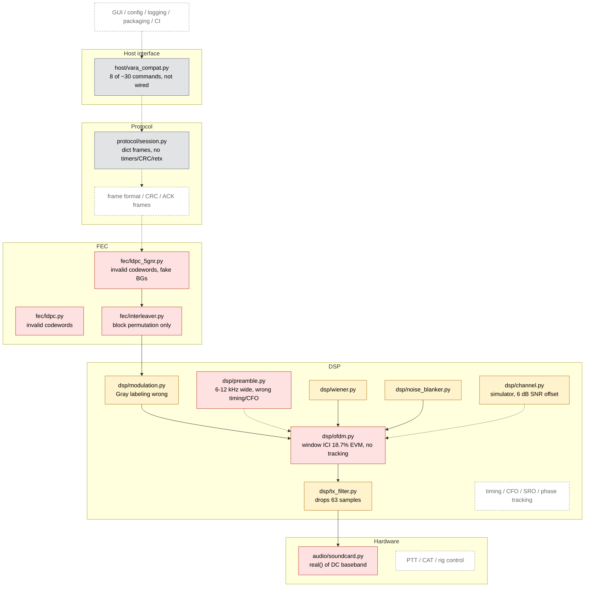
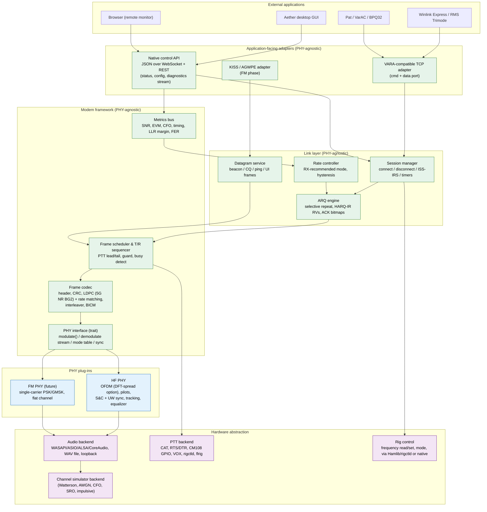

# Aether HF — Development Roadmap

**Version:** 0.1 (2026-09-13) · **Companion document:** [`AUDIT.md`](AUDIT.md) (detailed evidence)
**Goal:** turn Aether HF into a robust, open-source, VARA-HF-class ARQ modem for amateur HF,
shipped as professionally maintained Windows-first desktop software, with an architecture
that later carries an Aether FM PHY without duplicating the application.

---

## 1. Executive assessment

- **State of the repository:** 3 863 lines of Python across 26 files, 4 commits, no build
  system, no license file, no CI, no spec document. Every signal-chain layer is present as a
  module and every one of them is non-functional on a real channel (audit §2). No end-to-end
  path exists from bytes to audio and back. Nothing has been on the air.
- **Test evidence:** none. The 7/7 "conformance" result was produced by relaxing thresholds
  (e.g. FER < 0.10 → < 0.95) and by asserting detection without correctness. Both FEC
  encoders emit invalid codewords 100 % of the time; the HARQ test shows FER = 1.00 at
  every round and still passes.
- **Can it evolve into the target product?** The *design intent* can; the *code* mostly
  cannot. The right move is a **reference-model rewrite** in Python (keeping the module
  decomposition, the channel-simulator skeleton, the mode-table data structure, the
  constellation code), followed by a **production core** in a compiled language driven by
  golden test vectors from the model. There is very little working code to preserve, so
  this is cheaper than incremental patching.
- **Biggest strategic risks:** (1) shipping unverified performance claims again;
  (2) picking waveform parameters without a calibrated simulator; (3) building a GUI before
  a headless modem works; (4) FEC and sync — the two hardest DSP pieces — being under-scoped.
- **Biggest opportunities:** a *public* air-interface specification (also an FCC §97.309(a)(4)
  requirement in the US), a VARA-compatible host API that lets Winlink Express / Pat / VarAC /
  BPQ32 work day one, real HARQ-IR via 5G-NR rate matching, and a web-technology UI that
  serves both the desktop app and remote/headless operation.

---

## 2. Current architecture



Solid arrows are the only connections that exist in code (and only inside individual test
functions). Dashed arrows are connections the design implies but the code does not make.

---

## 3. Major technical deficiencies and risks

Ranked by impact on the goal, with the audit reference.

| # | Deficiency | Impact | Audit ref |
|---|---|---|---|
| 1 | No working FEC (both encoders invalid; decoder ~1 s per short block) | Nothing below ~10 dB SNR is possible; HARQ, rate adaptation and all low-SNR claims are void | §2 `fec/*` |
| 2 | No synchronization (timing, CFO, SRO, phase) and a preamble 4× wider than the channel | Cannot acquire a real signal | §2 `preamble.py` |
| 3 | Audio path collapses the complex baseband; no passband placement | Cannot go on the air at all | §2 `soundcard.py` |
| 4 | OFDM window self-inflicts 18.7 % EVM | Caps the link at ~QPSK regardless of everything else | §2 `ofdm.py` |
| 5 | No frame format, CRC, ACK frames, ARQ timers, retransmission | No protocol exists to test | §2 `session.py` |
| 6 | Simulator mis-calibrated (SNR ref, Doppler σ, per-block normalization, no continuity, no CFO/SRO) | Every future number would be wrong by 3–6 dB | §4 |
| 7 | Test suite asserts nothing meaningful | Regressions invisible; false confidence | §3 |
| 8 | README claims unmeasured performance | Credibility risk for an open-source project | §2 README |
| 9 | Host API implements a fraction of VARA's public command set with wrong `CONNECT` syntax | Winlink Express / Pat cannot connect | §2 `vara_compat.py` |
| 10 | No build/packaging/license/CI | Cannot be installed, contributed to, or released | §2 missing |
| 11 | Pure-Python per-element DSP | Not real-time even for a prototype (150 s test run) | throughout |
| 12 | Mode table not derived from waveform (rates off by 2–2.5×; 3 000 Hz vs 2 300 Hz) | Spec/implementation inconsistency | §2 `constants.py` |

---

## 4. Recommended target architecture

### 4.1 Layering



Green = reused unchanged by Aether FM. Blue = per-PHY. Purple = hardware.

### 4.2 Process model

- **`aetherd` — headless modem daemon.** Owns audio, PTT, PHY, link layer, and the two
  network surfaces (VARA-compatible TCP; native WebSocket/REST). Runs as a console process,
  a Windows service, or embedded in the desktop app. Real-time threads: audio callback →
  lock-free ring → DSP worker; separate protocol thread; network threads.
- **Desktop GUI — separate process** (Tauri shell around a web front-end) talking to
  `aetherd` over the native API. The same front-end is served by `aetherd` for remote/headless
  monitoring. A GUI crash can never stop a transmission mid-frame or leave PTT keyed.
- **Python reference model — not shipped.** Bit-exact model of the PHY/codec used to design
  the waveform, generate golden vectors, and run the benchmark suite.

### 4.3 Language and stack (decision required — see ADR-0001 in Phase 0)

| | Python-only product | **Recommended: Python model + Rust core + Tauri GUI** | C++ core + Qt |
|---|---|---|---|
| Time to first on-air modem | fastest | model in Python first (same speed), port later | slower |
| Real-time robustness on Windows | fragile (GIL, GC, PyInstaller AV false positives) | excellent | excellent |
| Installer size / start-up | 150–250 MB, slow | ~10–20 MB, instant | ~30 MB |
| Signed auto-update | tufup (TUF), works but DIY | Tauri updater plug-in (Ed25519-signed, NSIS/MSI) built in | WinSparkle / Velopack |
| Cross-platform later | yes | yes (cpal, serialport, hidapi, Tauri) | yes |
| Contributor pool (ham DSP) | largest | growing; DSP crates (rustfft, num-complex) mature | large |
| Reuse of current code | design only | design + model | design only |

**Decision (2026-09-13, ADR-0001): Rust core + Tauri GUI, Python reference model.**
Keep Python as the *reference model and benchmark harness* (Phases
0–2 do all DSP design there), and build the shipped product as a **Rust workspace**
(`aether-fec`, `aether-phy-hf`, `aether-link`, `aether-modem`, `aether-hal`, `aether-api`,
`aetherd`) with a **Tauri v2** desktop shell. Port module-by-module against golden vectors
so the two never diverge. If you prefer to stay Python-only, the model *is* the product:
add a C/Rust extension for the LDPC decoder (PyO3), PySide6 for the GUI, PyInstaller +
Inno Setup for packaging and `tufup` for updates — the roadmap phases are identical;
only Phase 4/5 tooling changes. This is the one decision to confirm before Phase 1
implementation starts; Phase 0 is unaffected by it.

### 4.4 Proposed repository layout

```
aether-hf/
  docs/            spec/ (air-interface, control-api, host-interfaces), adr/, dev/, user/
  model/           Python reference model + benchmarks (evolves from aether_hf/)
  core/            Rust workspace (crates above)
  app/             Tauri desktop app (TypeScript front-end shared with remote UI)
  vectors/         golden test vectors (bits ↔ audio, per mode, versioned)
  tools/           benchmark runner, vector generator, audit probes
  .github/         workflows (ci, release, nightly), ISSUE_TEMPLATE, PULL_REQUEST_TEMPLATE
```

---

## 5. DSP / modem assessment and recommendation

### 5.1 Is OFDM the right waveform?

| Criterion | OFDM (pilot-aided) | Single-carrier serial-tone (MIL-STD-188-110-style, DFE) | DFT-spread OFDM / SC-FDE |
|---|---|---|---|
| Multipath 2–6 ms | CP absorbs it; per-carrier 1-tap EQ | needs 10–15-tap adaptive DFE at 2 400 Bd | CP + FD equalizer, same as OFDM |
| Doppler 1–2 Hz (Poor) | ICI ≈ fd/Δf ≈ 2–5 %: acceptable | best (no ICI concept) | same as OFDM |
| Flutter 10 Hz | poor (ICI 20–30 %) | degraded but usable | poor |
| PAPR / average TX power at fixed PEP | 8–10 dB → ~3–4 dB less average power than SC | 3–5 dB with RRC | 5–7 dB |
| Channel estimation | trivial (pilots) | training-sequence + tracking | pilots/UW, same as OFDM |
| Implementation & test complexity | lowest; open references (codec2 OFDM modes) | highest | moderate |
| Open prior art | codec2/FreeDV, FreeDATA | MIL-STD-188-110, STANAG 4285/4539 (public standards) | LTE uplink (public) |

**Recommendation:** keep OFDM for v1 — it is the fastest path to a working, benchmarkable,
publicly documented link and there are open on-air-proven references to compare against.
Two deliberate hedges: (a) run a **PAPR study in Phase 2** (clip-and-filter, tone
reservation, and DFT-spreading through a saturating-PA model) and adopt DFT-spread OFDM
if it buys ≥ 2 dB of average power; (b) keep the PHY behind a trait so a serial-tone PHY
could be added as "HF PHY v2" if benchmarks under Poor/flutter show a real gap. The
current code's *strategy* was defensible; its *parameters and implementation* were not.

### 5.2 Waveform starting point (to be finalized by simulation in Phase 1)

| Parameter | Proposal | Rationale |
|---|---|---|
| Audio I/O | 48 kHz (accept 44.1/96) | universal on Windows |
| Internal baseband | complex, 8 kHz, centre 1 500 Hz (configurable) | 6:1 integer resampling; 3 kHz channel; VARA-like placement |
| Subcarrier spacing | ≈ 40 Hz (N=200 at 8 kHz), Tu = 25 ms | ICI ≤ 5 % at 2 Hz; symbol long enough for cheap CP |
| Cyclic prefix | 6 ms (48 samples) → Ts = 31 ms, 32 Bd | covers ITU Poor (2 ms) and NVIS (up to 7 ms with extended CP option) |
| Carriers | 2 300 Hz: 57 (2 280 Hz); 2 750 Hz: 68; 500 Hz: 12 | US bandwidth limit now 2.8 kHz; VARA offers 500/2300/2750 |
| Pilots | comb every 4th carrier incl. both edges + full pilot symbol every 8th symbol | 2-D interpolation with no extrapolation |
| Preamble | 2 identical PN OFDM symbols on even carriers (Schmidl–Cox timing + fractional CFO) + 1 PN unique-word symbol whose index is the header (integer CFO, frame type, mode) — PN, never Zadoff–Chu (chirps confuse time and frequency) | ±250 Hz acquisition without CAT; deterministic frame timing |
| Windowing | proper raised-cosine with overlap-add (symbol extended by taper) + polyphase TX filter | spectral mask without ICI |
| Modulations | BPSK, QPSK, 8-PSK, 16-QAM, 64-QAM (Gray-labelled, BICM) | 32/128/256-QAM are not realistic on HF fading channels |
| FEC | 3GPP TS 38.212 LDPC **BG2** (K ≤ 3 840, rates 1/5 … 8/9) with circular-buffer rate matching, RV0–3 | one public code family covers all rates *and* gives HARQ-IR for free; Sionna/py3gpp as oracles. Fallback: IEEE 802.11n codes (648/1296/1944) + a PEG-designed low-rate code |
| CRC | CRC-16 header, CRC-24 payload before LDPC (5G style) | decode verification + false-decode floor < 1e-7 |
| Interleaver | row/column across the whole frame (time × frequency) + BICM bit interleaver | real burst/fade spreading |
| Low-SNR modes | BPSK R=1/5; BPSK R=1/5 + 4× spreading ("robust") | honest floor: ≈ −5 dB (3 kHz, Poor) at ~300 bps, ≈ −8 to −10 dB at ~80 bps. Drop the DSSS/FSK "emergency" concept |
| Sync tracking | SRO from pilot phase slope; phase from pilots per symbol; timing re-lock per frame | sound cards differ by ±100–200 ppm |
| TX envelope | preamble PAPR ≤ data PAPR; constant average power across preamble / data / ACK; soft ramp-up and ramp-down; no level step between frame parts | field complaint about Mercury: ALC spikes at TX start (see `COMMUNITY-CONCERNS.md` #8) |

Raw-rate sanity, computed by `model/aether_model/waveform.py` from these defaults (57 carriers,
15 comb pilots, 42 data, 32.3 Bd, one pilot symbol in eight): QPSK ½ ≈ 1.19 kbps,
16-QAM ¾ ≈ 3.6 kbps, 64-QAM ⅚ ≈ 5.9 kbps before framing/ARQ overhead (×1.19 for 2 750 Hz) —
the same rate class as VARA's public figures. The 25 % comb-pilot overhead is deliberate
for Poor-channel tracking; a sparser scattered grid is a Phase 2 experiment.

### 5.3 Protocol (link layer)

- **Roles:** ISS/IRS with explicit `BREAK` turnaround; deterministic slot timing per mode
  so ACK expectations are exact.
- **Connect:** `CONNECT_REQ(src, dst, session-id, capabilities, bandwidth)` →
  `CONNECT_ACK(level, guard)`; callsigns in clear in every connect/ID frame (regulatory ID).
- **Data:** selective-repeat window 4–8 frames, 8-bit sequence numbers, per-frame CRC,
  ACK carries a bitmap + **receiver-recommended level** (receiver measures LLR margin /
  EVM / SNR — it knows best) + HARQ hint (NAK-near-miss → send RV1/RV2 rather than RV0).
- **Rate control:** hysteresis on RX-recommended level; step-down fast, step-up after N
  consecutive clean frames; never oscillate more than one level per ACK.
- **Robustness:** ACK frames use the most robust mode with a short preamble; connect
  attempts escalate mode; link-loss after M consecutive timeouts; idle keep-alive.
- **Datagram service:** beacon / CQ / ping (link-quality report) / UI frames — needed for
  VarAC-style workflows, busy-channel etiquette, and later KISS/AX.25 on FM.
- **Compression:** negotiated payload compression (zstd or LZMA dictionary) as a Phase 3
  option; Winlink traffic is text-heavy.

---

## 6. Protocol / API recommendations

Three independently versioned documents, each with its own conformance vectors:

| Document | Scope | Consumers |
|---|---|---|
| `docs/spec/air-interface.md` | PHY (waveform, preamble, pilots, modes), frame formats, FEC/rate matching, ARQ state machines, timers. **Public** (FCC §97.309(a)(4)). | other implementers, regulators |
| `docs/spec/control-api.md` | Aether-native JSON over WebSocket (+ REST for one-shots): `status`, `config get/set`, `connect`, `disconnect`, `send`, `metrics` stream (SNR, CFO, constellation, spectrum), `devices list`, `ptt test`, `audio calibrate`, auth token for non-loopback binds. PHY-agnostic; HF/FM differ only in the mode table. | GUI, remote web UI, third-party tools, tests |
| `docs/spec/host-interfaces.md` | Adapters: **VARA-compatible TCP** (command + data ports; full public command set: `MYCALL`, `LISTEN`, `CONNECT src dst [via]`, `DISCONNECT`, `ABORT`, `COMPRESSION`, `BW500/2300/2750`, `VERSION`, `PUBLIC`, `CWID`, `CHAT`, `PING`, `CQFRAME`, `TUNE`, `CLEANTXBUFFER`, `WINLINK SESSION`, `P2P SESSION`; events `OK/WRONG/BUFFER n/CONNECTED/DISCONNECTED/PENDING/CANCELPENDING/PTT ON|OFF/BUSY ON|OFF/IAMALIVE/REGISTERED`), later **KISS** and **AGWPE** for the FM/packet use-case. | Winlink Express, RMS Trimode, Pat, VarAC, BPQ32 |

Rig control is *not* an application-facing API; it is a HAL backend (Hamlib `rigctld`
client, `flrig` XML-RPC, native CAT for a few very common radios, serial RTS/DTR, CM108,
VOX). Virtual COM/serial host interfaces are not needed for HF (nothing in the Winlink
ecosystem uses them for VARA-class modems); revisit for FM/KISS.

---

## 7. Testing and benchmarking strategy

Principle: **every DSP or protocol change must move a number on a committed curve, or it
does not merge.**

### 7.1 Test tiers

| Tier | Tool | Runs | Examples |
|---|---|---|---|
| Unit | pytest (model), `cargo test` (core) | every push, < 2 min | LDPC encode → H·c = 0 for 1 000 random blocks; Gray property; CRC vectors; interleaver bijection; resampler passband ripple; frame codec round-trip; ARQ state machine transitions |
| DSP regression | pytest + golden vectors in `vectors/` | every push | bit-exact TX waveform per mode; RX from recorded WAV yields expected bits; sync timing error ≤ 1 sample and CFO error ≤ 0.5 Hz at 0 dB across ±250 Hz and ±200 ppm SRO |
| Protocol | two in-process modems over the simulator | every push | connect / transfer 10 kB / disconnect on Good/Moderate/Poor at fixed SNRs; no PTT stuck; retransmission counts bounded |
| Benchmark | `tools/bench` → CSV + plots, committed baselines | nightly + on demand | FER-vs-SNR per mode per channel; throughput-vs-SNR; connect probability; latency |
| Hardware loop | virtual audio cable / two sound cards / SDR loop | manual, pre-release | real audio path, PTT timing, level calibration |
| Field | recorded on-air sessions saved as WAV + metadata | per milestone | replayable into the regression tier |

### 7.2 Impairment set (all in the simulator, all seedable)

AWGN · ITU-R F.1487 mid-latitude Good/Moderate/Poor (0.5 ms/0.1 Hz, 1 ms/0.5 Hz,
2 ms/1 Hz) · Flutter (0.5 ms/10 Hz) · NVIS (7 ms/1 Hz) · Rician K=10 dB · CFO ±250 Hz
static and ±5 Hz/s drift · SRO ±200 ppm · phase noise · Middleton class-A impulsive ·
adjacent-channel interferer (SSB voice/CW carrier at −6 … +20 dB) · saturating PA / ALC
model · deliberate packet loss & corruption at the frame layer · audio clipping / DC offset.

### 7.3 Metrics (definitions live in `docs/dev/metrics.md`)

BER · FER (after CRC) · packet success rate · connection-establishment probability vs SNR ·
effective throughput (bytes/s incl. ACKs and turnarounds) · latency (first byte, ACK
round-trip) · retransmissions per kB · **minimum usable SNR** (SNR at FER = 10 % per mode)
· robustness vs CFO/SRO (SNR penalty at 0.5 dB steps) · PAPR / average-power efficiency ·
CPU time per second of audio. **All SNRs referenced to 3 kHz noise bandwidth.**

### 7.4 Acceptance gates (initial targets; revised as data arrives)

- QPSK R=½ AWGN: FER < 1 % at ≤ +3 dB. BPSK R=1/5 AWGN: FER < 10 % at ≤ −7 dB.
- ITU Poor: at least one mode with FER < 10 % at 0 dB; throughput ≥ 300 bps at +5 dB.
- Sync: acquisition probability > 99 % at the lowest mode's threshold, CFO ±250 Hz.
- Protocol: 10 kB transfer completes on Poor at +5 dB in ≤ 1.5× ideal air time.

---

## 8. UI / UX improvements

- **Setup wizard** (first run): callsign → audio devices (auto-suggest by name: Digirig,
  SignaLink, IC-7300/7610/705, FT-891/991, "USB Audio CODEC") → PTT method with a **test
  key** (measures actual TX-on delay via audio loop when possible) → rig control probe
  (scan COM ports, try Hamlib backends / rigctld / flrig) → **level calibration**
  (RX: show headroom/clipping meter while user adjusts; TX: transmit tune tone, user sets
  drive for ALC zero, wizard stores level) → loopback self-test → done.
- **Main window:** connection panel (my call, remote call, bandwidth, connect/disconnect/
  abort), state banner (Listening / Connecting / Connected ISS/IRS / Busy channel /
  Device error), live meters (RX level, SNR, CFO, mode, throughput, retries, buffer),
  waterfall/spectrum with the passband marked, constellation, TX/RX activity LEDs.
- **Diagnostics view:** LLR-margin history, timing/SRO estimates, PTT timeline,
  frame log (type, seq, mode, CRC ok), "Save diagnostic bundle" (config with secrets
  scrubbed, last 10 minutes of log, last 30 s of RX audio, version/OS/device info).
- **Error messages** written for operators ("The sound device *USB Audio CODEC* was
  unplugged. Reconnect it or choose another in Settings → Audio."), never stack traces.
- **Settings profiles** per radio/site (portable JSON), import/export.
- **Accessibility:** full keyboard navigation, labelled controls, high-contrast theme,
  no information conveyed by colour alone.
- **Logging:** structured (JSON lines), rotating, levels; correlation IDs per session.

---

## 9. Build, installer, CI/CD and automatic updates

| Concern | Recommendation |
|---|---|
| Versioning | SemVer; `vX.Y.Z` tags; Conventional Commits; `git-cliff` (Rust) / `release-please` for changelog |
| CI | GitHub Actions matrix (windows-latest, ubuntu-latest, macos-latest): lint (ruff/clippy), unit + DSP regression, protocol tests, benchmark smoke; cache `cargo`/`pip` |
| Reproducible builds | pinned toolchains (`rust-toolchain.toml`, `uv.lock`/`requirements.lock`), locked npm deps, SBOM via `cargo auditable` / `cyclonedx` |
| Installer | Tauri bundler → NSIS `.exe` (per-user install, no admin) + MSI; Linux `.deb`/AppImage; macOS `.dmg` (Apple Silicon, unsigned until there is an Apple Developer certificate — 2026-09-16). Clean uninstall keeps `%APPDATA%\AetherHF` unless user opts to remove |
| Settings migration | `config.json` with `schema_version`; ordered migration functions; backup previous file on every upgrade |
| Signing | Ed25519-signed update manifests (Tauri updater / minisign) from day one; Windows Authenticode via **SignPath.io free OSS signing** or Azure Trusted Signing when eligible; until then document the SmartScreen warning |
| Auto-update | Tauri v2 updater plug-in: checks `https://…/releases/<channel>/latest.json`, verifies signature, downloads, prompts, installs, restarts. Python alternative: `tufup` |
| Rollback | keep previous installer in `%LOCALAPPDATA%\AetherHF\rollback\`; "Restore previous version" in Help menu; updater refuses to install if post-install self-test (daemon starts, audio enumerates) fails |
| Channels | `nightly` (every main commit, prerelease, 7-day retention), `beta` (`vX.Y.Z-beta.N` tags), `stable` (`vX.Y.Z`); channel selectable in Settings; stable never auto-jumps to beta |
| Release gate | tag → CI must pass all tiers incl. benchmark regression check (no curve worse by > 0.3 dB) → build → sign → GitHub Release with notes + SHA-256 + SBOM |

---

## 10. Documentation and open-source development

- `README.md` rewritten to state actual status; performance claims only with a link to the
  benchmark page that generated them.
- `docs/spec/` (three specs above) versioned with the code; `docs/adr/` (architecture
  decision records; ADR-0001 = language/stack, ADR-0002 = waveform parameters,
  ADR-0003 = FEC family); `docs/dev/` (build, test, benchmark, metrics definitions,
  coding standards); `docs/user/` (install, wizard, Winlink/Pat setup, troubleshooting).
- `CONTRIBUTING.md`, `CODE_OF_CONDUCT.md`, `SECURITY.md`, issue templates (bug report
  with diagnostic bundle attachment, feature request, on-air report with WAV), PR template
  with a "benchmark delta" section.
- Branching: trunk-based (`main` protected, short-lived feature branches, squash merges,
  required CI). Releases cut from tags; hotfix branches from tags when needed.
- Standards: ruff + mypy (model), clippy + rustfmt (core), eslint/prettier (app),
  pre-commit hooks, `cargo deny` for licenses.
- License: pick the dual **MIT OR Apache-2.0** the README already claims and add both files.
  Implement FEC from public standards (3GPP/IEEE) rather than importing LGPL code.
- `CLAUDE.md` at repo root describing layout, how to run tests/benchmarks, and the rule
  "no threshold changes in tests without an ADR".

---

## 11. Architecture for eventual Aether FM

The layering in §4.1 already isolates the PHY. Decisions to make **now** so FM is cheap later:

1. **PHY trait, not PHY constants.** `Phy::modes()`, `Phy::modulate(frame, mode)`,
   `Phy::feed(samples) -> events`, `Phy::sync_state()`. No global `FFT_SIZE`; the link layer
   reads frame durations and turnaround from the mode table.
2. **Sample-rate-agnostic HAL.** FM PHYs via a 9 600-capable data port want 48 kHz
   processing and ±6 kHz bandwidth; the HAL must not assume 8 kHz baseband.
3. **Timers from the mode table.** ACK timeouts, guard, max frame length are per-PHY data.
4. **Datagram service in the link layer** so an FM PHY can carry AX.25/KISS UI frames.
5. **Separate crates** (`aether-phy-hf`, later `aether-phy-fm`) with identical test
   harness contracts (golden vectors, simulator backend).
6. **Channel simulator with pluggable impairments** — FM needs flat channel + FM
   deviation/pre-emphasis models, not Watterson.

Aether FM PHY sketch: single-carrier QPSK/16-QAM (or GMSK for narrow) at 4.8–19.2 kBd
through the data jack, RRC pulse shaping, simple training-based equalizer, same preamble
philosophy (repeated block + UW), same 5G-NR LDPC/rate matching. Everything above the PHY
is reused, including the VARA-compatible adapter (with the FM command variants) and KISS.

---

## 12. Additional features worth considering

| Feature | Value | Phase |
|---|---|---|
| Headless daemon + web UI (already implied by §4.2) | remote stations, Raspberry Pi gateways, RMS operators | 3–4 |
| Built-in channel simulator as an audio backend | test Winlink/Pat end-to-end with no radio; demo mode; CI | 1 |
| Session audio capture + replay (`.wav` + JSON metadata) | every field failure becomes a regression test | 1 |
| Standard diagnostic bundle | supportable software | 4 |
| Link-quality ping / beacon with SNR report both ways | VarAC-style QSO tools, propagation checks | 3 |
| Busy-channel detector (energy + structure) | etiquette, required by Winlink Express (`BUSY`) | 3 |
| CW ID option and clear-text callsigns in headers | regulatory compliance, no-argument identification | 3 |
| Digirig / CM108 / IC-7300-class auto-detection profiles | zero-config for the most common hardware | 4 |
| Portable profiles (JSON) | club stations, emcomm go-kits | 4 |
| Winlink gateway mode notes (RMS Trimode compatibility) | more Aether-capable gateways = more usable network | 3/6 |
| PAPR-aware "average power" meter | operators see the real advantage of drive settings | 2 |
| Spectrum occupancy log | choosing frequencies; emcomm planning | 4+ |
| Modem-to-modem telemetry (SNR both ways in ACKs) | already part of ARQ design; expose in UI | 2 |
| Public gateway registry + beacon/CQ discovery frames | answers "where are the RMSs?" — the top adoption concern in the Mercury thread | 3 |
| Packaging for ham Linux distros (`.deb`, ARM64, LiaisonOS/DragonOS inclusion) | gateways run on Pis; distros are a free distribution channel | 3–5 |

Not recommended now: encryption (illegal on amateur bands in most jurisdictions), mesh/relay,
mobile apps.

---

## 13. Prioritized implementation roadmap

Dependencies are listed by task ID. "Files" refer to today's layout; the model will move to
`model/` during Phase 0.

### Phase 0 — Audit and stabilization (weeks 1–3)

| ID | Task | Depends on |
|---|---|---|
| P0-1 ✅ | Repo hygiene: `pyproject.toml` (uv/pip), `requirements.lock`, `LICENSE-MIT` + `LICENSE-APACHE`, `ruff`, `mypy`, `pre-commit`, `pytest` config, `.editorconfig` | – |
| P0-2 ✅ | GitHub Actions CI (Windows + Linux): lint + pytest; badge in README | P0-1 |
| P0-3 ✅ | Replace test suite: convert both test files to strict pytest; mark known-broken behaviour `xfail(strict=True)` with the audit finding as reason; delete relaxed thresholds | P0-1 |
| P0-4 ✅ | Rewrite README honestly; move audit + roadmap under `docs/`; add `CLAUDE.md`, `CONTRIBUTING.md`, issue/PR templates | – |
| P0-5 ✅ | ADR-0001 language/stack decision; ADR-0002 waveform parameter targets; ADR-0003 FEC family | P0-4 |
| P0-6 ✅ | Fix channel simulator: continuous low-rate fading with state, Doppler 2σ, no per-block normalization, correct F.1487 table, 3 kHz SNR reference, add CFO/SRO/adjacent-channel/PA-clip impairments; statistical unit tests (Rayleigh amplitude CDF, Doppler spectrum width, SNR calibration) | P0-3 |
| P0-7 ✅ | Delete `fec/ldpc.py`, stream-of-consciousness comments; regenerate `constants.py` from ADR-0002 | P0-5 |

Risks: scope creep into Phase 1. Acceptance: CI green on a suite where every assertion is
meaningful; simulator calibration tests pass; README makes no unmeasured claim.
Files: everything under `aether_hf/tests`, `dsp/channel.py`, `constants.py`, README, new `docs/`, `.github/`.

### Phase 1 — Core HF modem (weeks 3–12)

| ID | Task | Depends on |
|---|---|---|
| P1-1 ✅ | **FEC:** TS 38.212 BG2 LDPC encoder (double-diagonal + back-substitution), circular-buffer rate matching RV0–3, vectorized layered min-sum decoder (numpy; numba/Rust later); validate against Sionna/py3gpp; BLER curves for K ∈ {200, 500, 1 000, 2 000, 3 800} at rates 1/5…5/6 | P0-6 |
| P1-2 ✅ | **Constellations:** correct Gray labels, vectorized max-log LLR demapper with noise-variance input; tests for Gray property and LLR sign | P0-3 |
| P1-3 ✅ | **Frame codec:** header/CRC-16/CRC-24, row-column interleaver + BICM, mode table derived from waveform; spec §frames drafted alongside | P1-1, P1-2 |
| P1-4 ✅ | **OFDM TX:** carrier map with edge pilots, scattered pilot grid, windowed OLA, TX filter, passband placement, 8 k → 48 k polyphase; noiseless EVM test = 0 | P0-7 |
| P1-5 ✅ | **Preamble & sync:** band-limited S&C pair + UW; detector with fine timing (±1 sample) and CFO (fractional + integer) to ±0.5 Hz at 0 dB across ±250 Hz; SRO estimation; false-alarm rate test on noise/voice | P1-4 |
| P1-6 ✅ | **OFDM RX:** streaming demodulator with timing/CFO/SRO/phase tracking, LS + 2-D interpolation equalizer, noise-variance estimate feeding LLRs | P1-5 |
| P1-7 ✅ | **End-to-end PHY loopback:** bytes → WAV → bytes at every mode through the simulator; benchmark runner producing FER/throughput-vs-SNR CSV + plots; baselines committed | P1-3, P1-6 |
| P1-8 ✅ | **Audio HAL (model):** sounddevice backend + WAV backend + simulator backend, ring-buffered streaming, device enumeration, level metering; loopback via virtual cable on Windows | P1-4 |
| P1-9 ✅ | **Golden vectors v0:** per-mode TX waveforms and RX expectations in `vectors/` | P1-7 |

Risks: LDPC decoder speed in Python (mitigate: vectorize, numba); sync under Poor+CFO+SRO
combined. Acceptance: gates in §7.4 for AWGN; Poor channel FER curves exist for every mode.
New: `model/aether_model/{fec,phy,frame,hal}`, `tools/bench`, `vectors/`.

**Status (2026-09-13): Phase 1 complete in the model.** AWGN thresholds (FER < 5 %, 3 kHz,
with random CFO/SRO): BPSK ½ −1 dB, QPSK ½ +2, 16-QAM ½ +7, 64-QAM ⅚ +17 dB
(`bench/baselines/phy_fer_phase1_uw.csv`, summarised in `bench/README.md`). Acquisition
was reliable to ≈ −2 dB with the Phase 1 preamble; P2-3 (branch `phase-2`) replaced it
with a matched-filter bank and chip-signalled mode — acquisition is now 100 % at −5 dB and
87 % at −7 dB, and the BPSK 1/5 code (≈ −6 dB) is the floor. ADR-0002 carries the
amendments (PN preamble sequences, layouts, mode table, P2-3 air interface).

### Phase 2 — Link robustness and performance (weeks 10–20)

| ID | Task | Depends on |
|---|---|---|
| P2-1 ✅ | ARQ engine + session FSM (PHY-agnostic, event-driven `aether_model/link/`): selective repeat, ACK bitmap, RX-recommended mode, HARQ-IR combining with the RV carried in the pilot chips and the sequence number inferred for failed frames, connect/turn/disc handshakes, timers, BREAK, keep-alive. Two harnesses: a lossy-pipe discrete-event sim and a two-modem harness over the **real PHY + channel simulator** (bit-exact transfer; real LLR HARQ rescue below the mode threshold) | P1-7 |
| P2-2 ✅ | Rate controller with hysteresis (`link/rate.py`: inner loop on measured thresholds, adaptive outer-loop margin, fast-down/slow-up state machine — settles with zero oscillation at a mode boundary, absorbs a 14 dB collapse in ≤ 3 bursts); `tools/bench_link.py` goodput-vs-SNR benchmark on AWGN/Good/Moderate/Poor plus ±8 dB fade ramps, both backends (`bench/README.md`) | P2-1 |
| P2-2a ✅ | Start-of-frame signal from PHY to link layer (`PhyTiming.preamble_detect_s`, `LinkEngine.on_preamble`): the IRS holds its ACK as soon as it hears the next frame begin instead of waiting a whole data frame of silence. **+13 % throughput**; steady-state efficiency 0.67 → 0.75. Still to do in Phase 3: have the real receiver emit the callback from the streaming detector | P2-2 |
| P2-2c ✅ | Rate-controller threshold table measured for **all 14 modes** (`phy_fer_awgn14.csv`, `tools/update_rate_table.py`); the interpolated guesses it replaced were optimistic by up to 1.4 dB on the 64-QAM modes | P2-2 |
| P2-2b ✅ | The margin learns the channel: a failed burst at a known mode and SNR sets the implied penalty directly (capped 3 dB/burst) instead of creeping in fixed steps, and is held for three clean bursts before decaying. **+29 % on Moderate at +16 dB, +23 % on Good at +20 dB**; the controller now settles lower on fading channels and delivers more, because it no longer overshoots | P2-2 |
| P2-3 ✅ (acquisition) | Low-SNR acquisition: PMF-FFT matched-filter bank, type-by-preamble-sequence, chip-signalled mode (ADR-0002 amendment) — 100 % at −5 dB, 87 % at −7 dB. Still open: a spread/repetition mode below −6 dB and the connect-probability benchmark | P1-1, P2-1 |
| P2-4 ✅ | PAPR study & decision (ADR-0004): iterative clip-and-filter in the transmitter, 5 dB target for BPSK/QPSK/8-PSK and 7 dB for 16-QAM/64-QAM. **+1.0…+1.7 dB delivered power** (more on a harder ALC), PAPR 10 → 5.7/7.3 dB, splatter unchanged. Tone reservation and DFT-spreading measured and rejected. `tools/bench_papr.py`, `phy/papr.py` | P1-7 |
| P2-5 ✅ | Impulsive-noise defence: median-of-medians blanker ahead of band-limiting (`phy/blanker.py`, on by default) plus per-symbol noise variance so damaged symbols become erasures. Class-A bursts 25 dB above noise take the link from a **total loss at 1 % of samples to zero frame errors up to 10 %**, and cost nothing when there is nothing to blank. `tools/bench_impulsive.py` | P1-6 |
| P2-6 ✅ (measured, **not adopted**) | MMSE/Wiener channel estimation built (`phy/wiener.py`, with cross-validated design selection) and benchmarked against linear (`tools/bench_chanest.py`). Matched to the delay spread it wins on raw interpolation error by 1.3–5.3 dB, but the gain does not reach frame error rate and it is worse on every fading channel, so the default stays linear. Reason and reopening conditions in `bench/README.md` | P1-6 |
| P2-7 ✅ | `docs/spec/air-interface.md` v0.1 — public, FCC §97.309(a)(4), with every number generated from the model by `tools/make_spec.py` and a test that fails if it drifts — and `docs/spec/control-api.md` v0.1 | P2-1 |

Acceptance: §7.4 Poor-channel and protocol gates met; ADR-0004 recorded; specs published.

### Phase 3 — Application integration (weeks 16–26)

| ID | Task | Depends on |
|---|---|---|
| P3-1 ✅ | Rust workspace (`core/`) per ADR-0001, with `aether-fec` ported first: TS 38.212 CRCs, LDPC BG1/BG2 encode + layered decode, rate matching with HARQ-IR. Base-graph tables are generated at build time from the model's JSON, so both implementations share one source of truth; `tools/make_fec_vectors.py` + `tests/model_vectors.rs` prove them **bit-exact**. CI runs fmt, clippy `-D warnings`, tests on Linux + Windows, and fails if the vectors drift from the model | P1-9, P0-5 |
| P3-2 ✅ | Port PHY + frame codec + ARQ to core, cross-validated against the model. `aether-phy`: waveform, constellations, mode table, frame codec, OFDM, preamble, transmitter, receiver and acquisition — a frame can be built, found in a stream, demodulated and decoded entirely in Rust. `aether-link`: frame formats, rate control, the ARQ engine and session state machine, plus a lossy-pipe two-station simulator that exercises the protocol without DSP. Cross-validation found one real interoperability bug (SNR tie-rounding differs between Python and Rust), now fixed in both and pinned in the public spec | P3-1 |
| P3-3 ✅ | `aetherd`: audio via cpal (bounded queues, so a modem that falls behind drops audio rather than the machine), PTT via serial RTS/DTR or Hamlib's `rigctld` over TCP, the key-time watchdog (a trip latches until the key is released), a busy detector that learns the noise floor by minimum statistics, and the run loop that ties them to the link engine. Two stations complete a session over real 48 kHz audio in the test suite. Deferred: CM108 keying (needs a HID dependency and hardware to verify), flrig and native CAT | P3-2 |
| P3-4 ✅ | Native control API to `control-api.md` v0.1: JSON over WebSocket at `ws://127.0.0.1:8515/v1`, `POST /v1/<method>` for one-shots, `status`, `capabilities`, `connect`, `disconnect`, `abort`, `send`, `listen`, `devices.list`, and `state` / `metrics` / `data` / `ptt` / `log` events. Loopback needs no token; any other bind requires one and the daemon refuses to start without it rather than leaving a transmitter open. No async runtime: one thread per connection, commands passed to the modem over a channel so its single-threadedness stays a fact. Remaining for v1.0: `config.get`/`config.set`, `ptt.test`, `audio.calibrate`, and the subscribed constellation and spectrum streams | P3-3 |
| P3-5 ✅ (unverified in the field) | VARA-compatible TCP adapter: command port and the data port beside it, the published command set, and the session notifications, built as a *client of the control API* so it has no privileged access to the modem. `VERSION` answers with Aether's name, not VARA's, and `BW500`/`BW2750` are refused rather than silently served at 2300 Hz. Off by default. Verified against the test suite's own host client, by hand against the running daemon, and — in Phase 6 — **with Pat 1.0.0 at both ends over the simulated channel**: a P2P B2F session with a 6 kB incompressible attachment, byte-identical on arrival, which found and fixed the called side's `CONNECTED` order. Winlink Express, VarAC and BPQ32, and Pat on the air, are tracked in `docs/spec/host-interfaces.md` §7 | P3-4 |
| P3-6 ✅ | **Compression**: deflate on the payload byte stream above the ARQ (not per frame — a 26-byte frame with no history gets *bigger*), negotiated by the connect handshake's capability byte, used only if both stations offer it. Measured 27 % off a short message, 44 % off a 1.5 kB one. **Morse identification**: raised-cosine keying so it does not click, PARIS timing, off by default because only the operator knows what their licence requires. **Beacon**: a `BEACON` unproto frame carrying one callsign, sent at the most robust mode, reported with its SNR and never answered on the air | P3-5 |
| P3-7 ✅ | `docs/spec/host-interfaces.md` v0.1: the transport, the command set, the notifications, and an explicit table of what is accepted, what is merely recorded and what is refused — so a client can tell the three apart. Says plainly that this is software compatibility only and that an Aether gateway must not be advertised as a VARA gateway | P3-5 |
| P3-8 🔁 | **Adoption & ecosystem track** (from `COMMUNITY-CONCERNS.md`). Done: the daemon releases the transmitter on `SIGTERM` — a gateway killed mid-burst would otherwise stay keyed; a hardened systemd unit (`deploy/aetherd.service`); `docs/user/gateway-kit.md` (headless build, cross-compiling for ARM64, install, checking on it over SSH, Pat/RMS Trimode/BPQ32 notes, and the instruction not to list an Aether gateway as a VARA one); `docs/user/frequency-plan.md` (coexistence rules, suggested calling frequencies marked explicitly as a proposal rather than a standard, and an honest note that the busy detector does not yet recognise VARA or ARDOP specifically). Open: bundled Hamlib with an override path, the public gateway registry page, and contacting the Winlink Development Team once there is field data to show them | P3-3, P3-5 |

Risks: Winlink Express quirks (auto-launch path, `REGISTERED`, timing); a gateway advertised
as "VARA" but running Aether would strand real-VARA clients, so listing/coordination with
Winlink is a tracked dependency — build usage first where no central listing is needed
(VarAC, Pat P2P, BBS). Acceptance: Pat, VarAC and Winlink Express complete a P2P message
exchange over the simulator and over a virtual audio cable; a Raspberry Pi runs `aetherd`
as a service for 72 h unattended.

### Phase 4 — Production desktop application (weeks 24–36)

Tauri app (or PySide6): setup wizard, main window, diagnostics view, profiles, structured
logging, diagnostic bundle, accessibility pass, Digirig/IC-7300 auto-profiles, error-message
review. Acceptance: a new user installs and completes a Pat/Winlink session with only the
wizard; usability test with 3 external hams.

| ID | Task | Depends on |
|---|---|---|
| P4-1 ✅ | **The station panel, served by the daemon.** Plain HTML, CSS and ES modules with no build step (ADR-0005), served by `aetherd` at `http://127.0.0.1:8515/` with a path-traversal guard, so a headless gateway can be watched from a browser over an SSH tunnel and the desktop shell shows the same files. Status (state, mode, signal above the learned noise floor, a two-minute level chart, counters), Session (connect, disconnect, abort, beacon, send, received text), Log. Dark-first with a light variant that follows the system setting | P3-4 |
| P4-2 ✅ | **Settings over the API.** `config.get` / `config.set` with dotted keys, a merge on a copy that is validated before it replaces what is running, an atomic file replace, and `live_keys` so the panel can say which changes take effect now and which need a restart. The Setup panel's hand form (devices, keying port, callsign, copy as TOML) uses them | P4-1 |
| P4-3 ✅ | **The desktop shell** (`app/src-tauri`, Tauri v2): a window around the panel and a supervisor for the daemon. Starts `aetherd`, waits for the control port, attaches instead if one is already running, and on close asks it to stop over the control API — a killed process never runs its release path, and with `rigctld` keying that is a rig left in transmit. First run writes a receive-only configuration. Verified on real hardware on Windows | P4-2 |
| P4-4 ✅ | **The setup wizard.** Five steps with a radio in front of you: callsign; interface profile (Digirig, Icom and Yaesu USB audio, SignaLink) that pre-selects the devices from what the machine reports; a receive-level meter (`audio.level`: RMS and peak in dBFS, clipped fraction, and a sentence saying what to do); a keying test (`ptt.test`, keys with no audio at once — an SSB transmitter keyed with no audio radiates nothing) and a tune tone (`tune`, 1500 Hz at the configured drive, refused rather than deferred while the channel is busy); save. A serial profile saved without a port says so instead of silently writing a receive-only station. The host interface's `TUNE` now does something | P4-2 |
| P4-5 ✅ | **Structured logging and the diagnostic bundle.** Every line carries a UTC timestamp, level, event name, detail and the modem's state; `[log] format = "json"` for a journal or a shipper; `[log] file` because a packaged desktop daemon has no terminal. `diagnostics` returns version, platform, configuration with the token taken out, status, capabilities, devices, audio health and the last few hundred log entries, and never any traffic; the panel has a one-button copy. `config.get` no longer returns the token | P4-1 |
| P4-6 ✅ | **Accessibility pass and error-message review.** A real tab list (one tab stop, arrow keys), lamps that say their state in words and shape as well as colour, live regions where they help and `role="log"` where a live region would read every line aloud, labels on every field, a header that wraps on a phone. Daemon errors at the places a new user hits — missing or misnamed audio device, a device that will not run at 48 kHz, a serial port held by another program, `rigctld` not answering, a port already in use — say what went wrong and what to do | P4-1, P3-3 |
| P4-7 🔁 | **Acceptance.** Open, and not something this repository can close on its own: a new user installing and completing a Pat/Winlink session with only the wizard, and a usability test with three external hams. Also open: CM108 keying (Digirig's own is serial, but SignaLink-class HID interfaces are not), real icons for the shell, and packaging the daemon and panel beside the shell — Phase 5 | P4-4, P3-5 |

Risks: the wizard's device profiles match on the names Windows and ALSA give USB audio
devices, which vendors change; "Something else" is always offered. Acceptance is human and
external, and the field verification P3-5 still needs is the same session.

### Phase 5 — Release infrastructure (weeks 30–40)

Tag-driven release workflow, NSIS/MSI, Ed25519-signed update manifests, nightly/beta/stable
channels, settings migration tests, rollback, SBOM, code signing (SignPath/Azure), benchmark
regression gate. Acceptance: an upgrade from N−1 to N with settings preserved and a
forced-failure rollback both demonstrated in CI.

| ID | Task | Depends on |
|---|---|---|
| P5-1 ✅ | **One version number.** `tools/release.py check` fails when the daemon, the shell, the installer and the model disagree; `bump X.Y.Z` rewrites all five files and both lockfiles. CI runs the check; the release pipeline runs it against the tag | — |
| P5-2 ✅ | **The installer bundles the daemon and the panel.** `tools/stage_daemon.py` puts `aetherd` where Tauri's bundler picks it up as a sidecar; the panel is a bundled resource the shell locates through Tauri's own resolver. Per-user NSIS installer (no administrator), `.deb`, AppImage. Verified end to end on Windows: install, run, the sidecar starts and serves the bundled panel, uninstall. The first packaged run found the 44.1 kHz trap (a USB codec's Windows default format), so `devices.list` reports sample rates, the wizard warns before saving, the daemon's refusal names the device and the setting, and a daemon that fails to start is explained in a message box instead of a panel that says "not connected" for ever | P4-3 |
| P5-3 ✅ | **The release pipeline** (`.github/workflows/release.yml`): from a tag, the daemon for x86_64 and aarch64 Linux (built on Ubuntu 22.04 so it runs on a Raspberry Pi's Debian 12) and Windows, the desktop application for Windows and Linux, an SPDX SBOM, SHA-256 sums, and release notes from Conventional Commits (`cliff.toml`). `vX.Y.Z` is stable, `vX.Y.Z-beta.N` a prerelease, and a nightly runs on a schedule from the default branch into one rolling prerelease. Signed for the updater when `TAURI_SIGNING_PRIVATE_KEY` is set; a branch push saying `[dry-run]` builds everything without publishing (two dry runs green on all five targets) | P5-1, P5-2 |
| P5-4 ✅ | **Settings migration.** The configuration names its schema; an older file is brought forward through an ordered chain on load, backed up beside itself first, and rewritten; a newer file is refused with a message rather than read with keys dropped. `core/aetherd/tests/data/config/` holds files as each released version wrote them, and a test loads every one and checks no key or value is lost — the upgrade promise CI demonstrates from now on | — |
| P5-5 ✅ | **Signed updates and a way back.** The shell checks on start (on the channel `[update] channel` names, set from the panel) and asks before installing; stable never sees a prerelease; every installer it installs is kept locally and *Help > Restore the previous version* runs the kept one without a network. The Ed25519 public key is in `tauri.conf.json`; the private key is on the maintainer's machine and has to be added as a repository secret before the first signed release | P5-3 |
| P5-6 ✅ | **Benchmark regression gate.** `tools/bench_gate.py`: a seeded AWGN sweep of four modes compared with `bench/baselines/gate_awgn.csv` at the 10 % frame-error point; the release pipeline refuses to publish if any mode lost more than 0.3 dB. Measuring the baseline showed QAM16-1/2 0.4 dB behind the pre-ADR-0004 table; a re-sweep of modes 6–10 found it to be two frames in thirty on a grid point, with the other 16-QAM modes unchanged to 0.02 dB (`bench/README.md`) | P5-3 |
| P5-7 🔁 | **Open.** Windows Authenticode signing through an open-source signing service (until then `docs/user/install.md` explains the SmartScreen warning); the first actual tagged release, which needs the signing secret in place; real icons; an MSI alongside NSIS if anyone asks for one | P5-5 |

Acceptance as written asks for an N−1 → N upgrade and a forced-failure rollback demonstrated
in CI. The upgrade half is the fixture test in P5-4 (it will have real N−1 files once there
is an N−1). The rollback half is exercised by hand — the kept-installer path is a native
installer run, which a runner without a desktop cannot drive — and stays a release-checklist
item in `docs/user/install.md` until it can be automated.

### Phase 6 — Field validation (weeks 36–48, overlapping)

Local audio-cable tests → two stations ground-wave → NVIS → 500–2 000 km paths → RMS
gateway trial. Every session recorded (WAV + metadata) and folded into the regression
tier. Compare measured throughput to simulator predictions; recalibrate the simulator.
Acceptance: ≥ 20 logged sessions across ≥ 3 channel classes; simulator-vs-air throughput
within 20 %.

| ID | Task | Depends on |
|---|---|---|
| P6-1 ✅ | **Session recordings.** A 48 kHz WAV of what the radio delivered and a JSON sidecar of what the modem made of it — every frame with mode, RV, SNR, offset, decoded or not, control frames described; every event; keying; counters; the operator's notes. `record.start/stop/notes` on the API, a Record button on the panel, `[record] auto = true` for every session on its own. Header and sidecar refreshed every five seconds so a crash leaves files that play | P4 |
| P6-2 ✅ | **Replay and the field regression tier.** `aetherd --replay` runs a recording through the same front end and receiver a live station uses, muted where the transmitter was keyed, and fails if fewer frames decode than did on the day. `field/sessions/` holds the recordings worth keeping; `core/aetherd/tests/field.rs` replays every one on every test run | P6-1 |
| P6-3 ✅ | **The simulated channel and what it found.** `[sim]` joins two daemons over a socket with noise at a set SNR, paced by the clock — the bench reference and the way host software is driven with no radio. `tests/two_daemons.rs` runs two real daemons through a session. Its first run found two engine bugs the deterministic simulator could not: the engine waited for replies from when it handed a burst over rather than when it left the sound card (`PhyTiming.tx_latency_s`), and an acknowledgement accepted during a re-poll was dropped and never retried (`on_tx_done` now tries). Fixed in the model first, then the port, with tests in both that fail without them | P3-3 |
| P6-4 ✅ | **Measured against predicted.** `tools/compare_air.py`: per-mode frame error rate and session goodput beside the benchmark curves' prediction at the same SNR, per channel class, with the 20 % verdict. Calibrating it showed `tx_level` documented 3 dB wrong (the waveform's RMS is the level over √2); the documentation, a test and the simulated channel's noise now agree with the receiver to within 0.5 dB | P6-1 |
| P6-5 ✅ | **The protocol.** `docs/user/field-test.md`: bench first, then the cable, then the air; what a session should carry; how to name the channel class; what to keep. `field/LOG.md` is the twenty rows | — |
| P6-6 🔁 | **The air.** Audio cable → ground wave → NVIS → 500–2 000 km → RMS gateway trial; twenty sessions across three classes; recalibrate the simulator on the disagreements. Human, and not something this repository can do for itself. Bench row 0 is in `field/LOG.md`: the Pat session measured 686 bit/s against 1 059 predicted for the same session size with a real station's latency — the rest is B2F's own round trips, which the simulator's single transfer does not model. VarAC 15.0.18 was tried over `[sim]`: it talks to the adapter (three of its start-up commands were `WRONG` and are now heard; its `VERSION` parser wants three words, which the reply now is) but its ecosystem is 500 Hz — it disables its interface until `BW500` is `OK` and refuses to call at 2300 Hz on a calling frequency — so VarAC needs a 500 Hz waveform (P7-0). **Winlink Express 1.8.5.0 passes the bench too**: two instances over `[sim]`, a P2P message with a 6 kB incompressible attachment byte-identical on arrival, 854 bit/s measured against 1 049 predicted (0.81). It found the bug the Pat bench could not: Pat's `MYCALL` happened to match the daemons' configured callsigns, Winlink Express's did not, and `MYCALL` had never reached the modem — now it does, in the model and the core (`callsigns.set`, `connect` with `callsign`). Both benches are rows in `field/LOG.md`. **The first radio-to-radio test ran 2026-09-17** (40 m, 500 Hz, mobile ↔ home): the link established and carried data both ways, but held a clean session only once in six — a compression-stream desync on the lossy path and a large frequency offset on the mobile's frames are the two findings, with the action list and the next-test protocol in `field/OTA-FOLLOWUPS.md`. **The ND1J Test sessions (2026-09-25, ND1J in Senoia ↔ KK4ODA near Northlake Mall, Atlanta; 40 m and 80 m)** found the tone bursts overrunning the key watchdog — the cut frame pinned the link to the floor — and the Test's ladder never reached: ADR-0017 (beta.58) | P6-1…P6-5 |
| P6-7 🔁 | **On-air crowdsourcing.** *2026-09-16: (b) built — `test.start`/`test.status`/`test.abort`, the Session tab's Test session button, `[operator]` grid/rig/power/antenna in Setup step 1 and in every sidecar, the path length from the two grids; the mode ladder rides on the engine's new `pin_mode` and the re-encoding of a stranded frame (model first). On the clean loopback the ladder already shows the two 64-QAM modes (12, 13) decoding short at a reported 24–26 dB — ADR-0008's open question, now a number P9-1 can start from. (c) the panel's Contribute action (a pre-filled issue link) is built; `field_ingest.py` and (d) `bench_link --replay` are next.* The one thing no bench can give is how each mode behaves on real paths, per channel class, and what the receiver's SNR estimate means there — so every volunteer contact should leave a sidecar the bench can replay, with no effort from the volunteer. (a) The author's station unattended and answer-only (`[radio] answer_only`, auto-recording on, a beacon schedule) on a 500 Hz calling frequency and a 2300 Hz slot at agreed times. (b) A **Test session** — one control-API method and a panel button — that runs a fixed sequence and records it: Probe (both directions' SNR, ADR-0006), a 2 kB message, a 16 kB file, and a **mode ladder** of short bursts pinned at each mode from the floor up until three fail: real FER against measured SNR per mode on a real path; the sidecar gains the volunteer's grid, rig, power and antenna, and the path length from the two grids. (c) A submission path with no infrastructure at first: the diagnostics bundle grows a *Contribute this session* action (sidecar always, audio opt-in) that opens a pre-filled GitHub issue or an email; `tools/field_ingest.py` folds submissions into `field/LOG.md` and a per-path CSV; a hosted collector only when the volume asks for it. (d) The use: `bench_link --replay <sidecar>` runs the model's engines against the recorded SNR trace and failure pattern, so every controller change is judged on real paths; per-class penalties fitted from real ladders (the on-air equivalent of `channel_thresholds`); the SNR estimator checked against what the ladder decoded; acquisition misses and false-busy on real noise; and the open question of ADR-0008 (a 64-QAM first burst on a clean loopback) answered with hundreds of first bursts. (e) Honest and safe: volunteers run the beta through the wizard (which is also the three-hams item), the sequence sends only test bytes, and the aggregated curves and a heard map are published back to them | P6-6, P7-1 |

### Priorities from 2026-09-15 — what is left, in order

Decided with the author after beta.14. **Aether FM and the phone are on the back burner**;
the modem itself comes first, and the 500 Hz waveform comes first of all, because it is the
bandwidth P2P contacts are made in — VarAC's calling frequencies are 500 Hz and it refuses
anything else there — so on-air testing with other stations needs it before it needs
anything else. Every item is model first, benchmark curve second, port third; the air
(P6-6) runs alongside all of it and each item wants a row in `field/LOG.md`.

| Order | Item | Why now |
|---|---|---|
| 1 | **P7-0** the 500 Hz waveform | P2P and the calling frequencies; the plan's 30 m slot; the home of the sub-200 bit/s floor |
| 2 | **P7-1** the link probe | VarAC and VARA Chat probe before they call; shares P7-0's answer-only rule; the dashboard already shows both SNRs |
| 3 | **P9-2** a faster start from the connect frames' SNR | small, model-first, a measurable win on every short session |
| 4 | ~~**P9-4** modes below 200 bit/s~~ | done 2026-09-16 (ADR-0009): the floor family at 500 Hz |
| 5 | **P9-1** the A/B bench against registered VARA at the audio level | the tool can be built any time; the runs need the author's evening; it is what licenses "comparable" |
| 6 | **P9-3** sparser pilots, a short prefix, 2 750 Hz | the top end; the 2 750 Hz piece shares P7-0's handshake work |
| 7 | **P9-5** time diversity | after the floor exists to measure it against |
| — | **P6-6** the air | continuous: cable → ground wave now at 2 300 Hz; P2P with VarAC users once P7-0 is out |

Small things for the gaps between: ~~CM108/GPIO keying~~ (done 2026-09-16: `[ptt] kind =
"cm108"`, the DRA/URI/RA-40 class by their USB ids, untested on hardware), BPQ32 over
`[sim]` (human), three hams through the wizard
(human), Authenticode signing (needs a certificate) and Apple signing/notarization (needs a
developer account; the macOS dmg ships unsigned and untested on hardware), the panel's SNR
history surviving a reload. **Host benches still owed (human, scratch copies under `C:\Dev\AetherBench`):**
Winlink Express P2P again at 500 Hz and on the engine as it is now (its 2300 Hz pass
predates the faster start and climb; `BW500` from its bandwidth setting must come back
`OK`) — a `host-interfaces.md` §7 row; and **RMS Trimode with RMS Relay over `[sim]`**, a
Winlink Express client calling an Aether-fed Trimode as a gateway, which speaks the same
VARA TCP port (`LISTEN ON`, `PUBLIC ON`, `CWID`, several `MYCALL`s, `CONNECTED` for
incoming calls). Two things to know before that one: Trimode needs a Winlink sysop
account to run, and a *public* RMS gateway on Aether is the Winlink Development Team's
call, not ours — the bench proves the modem side; the policy conversation is separate.
BPQ32 is the open-source gateway route and reaches AX.25 as well. **Back burner:** Phase
10 (Aether FM) and Phase 8 (the phone).

### The weak-signal plan from 2026-09-23 — what is left, in order

Decided with the author after the first 10-mile test and the sessions with W4TGA. Those
sessions ran their data at mode 0 — the slowest 2300 Hz mode — at −4 to +2 dB and still lost
about 40 % of the frames: the session had not started too high, the table has nothing below
mode 0, and mode 0 needs about +2 dB on ITU Good against −5.2 on AWGN (the per-class 10 %
crossings `bench_link.channel_thresholds` reads from `phy_fer.csv`; +1.2 Moderate, −0.3
Poor; the 500 Hz floor's mode 0 −2.0 on Good). VARA HF's published v4.3 speed-level table
puts narrowband noncoherent FSK at the bottom (18–175 bit/s; the two lowest levels the same
in every bandwidth), a few carriers in the middle and the full band only at the top; the
author's videos of VARA calling at 2300 Hz show a call a few tones and about 150 Hz wide,
whose envelope measured 6–7 dB peak-to-average through the speaker. Aether's frames, as
transmitted with ADR-0004's peak reduction, measure 5.9 dB (PSK) and 7.5 dB (QAM) at their
highest sample (`bench/baselines/peak_to_average.csv`, `tools/bench_peak.py`; 10.6 without
the reduction): a steady tone would put about 6 dB more average power on the air from the
same peak. The benches compare modes at equal *average* power while a transmitter's ALC
limits *peak* power — the author's 50 W setting gave 8–10 W average — so neither
concentrating the power nor a steadier envelope has ever been counted.
On the link bench, starting lower changed no 2300 Hz outcome and cost time; at 500 Hz a
margin sized for fading carried the marginal cases (Moderate 0 dB 2/20 → 19/20, Good 3 dB
13/20 → 20/20) at 2–3× the time on a clean channel, and starting at mode 0 alone made Good
worse (7/20) — the lever is knowing the channel, not the first mode.

The rule stands: VARA is a black box; its public documents describe an architecture, not
numbers to copy. Every design below comes from public standards and open literature, is
built in the model first, and ships only with its curve on Good, Moderate and Poor.

| Order | Item | Done when |
|---|---|---|
| 1 | ~~**P9-6** trustworthy benches~~ | done 2026-09-23: the floor bug fixed, the fading pipe within a fifth of the real modem at six spot checks, every curve readable at equal peak power |
| 2 | ~~**P9-7** a start that assumes a fading path~~ | done 2026-09-24 as **holding the link** (ADR-0012): the start was not the problem on the calibrated bench; the link timeout, silence and a trampled ACK were. 500 Hz from 0 dB up 30/30 on every channel, −4 dB 27–30/30 (10/30 before); 2300 Hz unchanged. Owed: one on-air session on a marginal path |
| 3 | ~~**P9-8** the tone floor~~ | done 2026-09-24 (ADR-0013, model then port): the gate passed by 7.7 and 8.5 dB on Good and Moderate (6.0 AWGN, 11.5 Poor) at 36 bit/s; 2 300 Hz sessions complete down to −14 dB on the fading pipe, where nothing below −4 did. Owed: the air in both bandwidths. Open: one two-daemon run on a macOS CI runner had the receiving station acknowledge four seconds into a tone burst and trample its second frame (1 of 2 runs there; not reproduced in 6 local runs or the re-run) — CI now keeps the audio of a failed two-daemon run, which is what it takes to replay it |
| 4 | ~~**P9-9** middle modes — **fast tones** on the 2 300 Hz air~~ | done 2026-09-24 (ADR-0014, model then port, beta.53): the floor's frame with its data at 50 and 100 Bd — 76, 112, 157 and 228 bit/s as rungs 2–5 of the wide ladder, one detector for every kind; the gate passed by 5.2 and 5.5 dB on Good and Moderate at a higher rate than BPSK ⅕, and sessions on the fading pipe run two to three times faster from −6 to −2 dB, nothing slower. Owed: the air at 2 300 Hz. What was planned: the curves show the gap (tone-36 at 54 bit/s, −17.3 dB; the first OFDM rung at 197 bit/s, −5.1 dB) and a candidate that more than fills it: the tone floor's 16-FSK at 50 and 100 baud (800 and 1 600 Hz wide). Genie timing, 40 frames a point: 72, 108, 143 and 215 bit/s at −15.6, −14.7, −13.1 and −11.2 dB on AWGN; the 215 bit/s kind beats BPSK ⅕ by 6.1 / 6.3 / 5.2 / 3.7 dB on AWGN / Good / Moderate / Poor. Gate: through the detector, ≥ 3 dB over the OFDM rung it displaces at equal rate on Good and Moderate, and session throughput on the fading pipe up from −10 to 0 dB with no class worse elsewhere |
| 4b | ~~**P9-10** middle modes on the 500 Hz air — **four tones at 100 Bd**~~ | done 2026-09-24 (ADR-0015, model then port, beta.54; asked for ahead of P9-5, because P2P contacts and VarAC's calling frequencies are 500 Hz): the floor's frame with four data symbols a slot on four tones 100 Hz apart, inside the floor's 400 Hz — 76 and 112 bit/s as rungs 2–3 of the narrow ladder; the gate passed by 4.2 and 6.9 dB on Good and Moderate against QPSK ⅓ at its rate, and 500 Hz sessions on the fading pipe run 1.3–1.7 times faster from −8 to 0 dB, nothing slower; no floor-boundary cap at 500 Hz. Found on the way and fixed on both airs: a strong frame of one air's middle kinds was taken by the other air's detector for a frame of another kind — a sync symbol holding another strong tone now contradicts a frame. Owed: the air at 500 Hz |
| 4c | ~~**P9-11** calls, probes and beacons on the tone floor~~ | done 2026-09-24 (ADR-0016, model then port, beta.55; the author asked whether the start was still optimistic — it was, before anything is known of the path): a call's first try, every probe and every beacon go out on the tone floor, 14 dB below the OFDM robust mode they used; a call alternates families from there, a probe is answered in its own family. On the fading pipe a probe is answered down to −12 dB on every class (none below −4 dB before), a weak path connects in 11 s instead of 20, and a strong path's handshake costs 11 s instead of 3. The floor's SNR reading tops out near +17 dB (+5 on ITU Poor), so a session seeded from it starts again from its first ordinary burst. Owed: the air |
| 5 | ~~**P9-5** time diversity~~ **paused** | paused 2026-09-24 by the author's decision: a nice-to-have, built — if at all — as an **experimental mode an operator turns on**, off by default, once the daemon as it is has been tested on the air. The first look is recorded in the P9-5 row below |
| 6 | **P9-1** the A/B against VARA through the channel cable | a baseline any time; the comparison after P9-8; the author's runs |
| opt. | **P9-12** a spread-tone floor — **an option** | not scheduled (2026-09-24, at the author's request): built only if the air shows the 400 Hz floor losing to selective fading, or to a carrier parked on it, where a wider signal would have got through. The P9-12 row below has the design space and the gate |
| — | **P9-3** the top end after these; **P6-6** the air throughout | |

Dropped by decision: making the 500 Hz floor frames the bottom of the 2300 Hz table. The tone
floor does that job better and in both bandwidths, and the 2300 Hz receiver would pay about
three times its CPU for the narrow floor's detector (0.32× against 0.09–0.10× real time on the
author's mini PC). Folded into P9-8: sturdier acknowledgements — they travel in the tone floor
when the link is weak; if P9-6 finds two decibels or more for free in lower-peak control
frames, that small step joins P9-7. Until P9-8 ships, weak paths use 500 Hz: its floor has
decoded live since beta.49 (ADR-0009 §8).

---

### Phase 7 — The 500 Hz waveform and the link probe (next)

The bandwidth P2P contacts are made in, and the probe those contacts start with. The FM
foundation this phase was first named for is Phase 10 now.

| ID | Task | Depends on |
|---|---|---|
| P7-0 ✅ | **The 500 Hz waveform**, ahead of FM. ADR-0002 anticipated it (12 carriers); VarAC's ecosystem runs on it and refuses to operate at 2300 Hz on a calling frequency, so VarAC support is this and nothing else (`host-interfaces.md` §7). Model first: numerology, modes and benchmark curves; then the core, the mode table in the air-interface spec, `BW500` accepted, and the bandwidth carried in the connect handshake so the two stations agree. One rule shapes it: in the US an automatically controlled station may use 500 Hz *outside* the §97.221(b) segments only to **answer** (§97.221(c)), so the daemon needs an unattended, answer-only mode — no calls, no beacons — and `docs/user/frequency-plan.md` §3 says why | — . **2026-09-15: a–c done** — model (`frame/modes.py` `NARROW`, ten modes from QPSK ½, 32 chips at 0.25, threshold 0.56, bandwidth bits in the handshake; `bench/baselines/phy_fer_500.csv`: −5.2 dB floor on AWGN, the wide floor's, ≈ 2 dB worse on ITU Good), port (`aether-phy` tables per waveform, bit-exact vectors; `aether-link` thresholds from `PhyTiming`; `aetherd` `[radio] bandwidth = 500`, `answer_only`, `BW500`, recordings and replay know the waveform; two daemons complete a 500 Hz session). **d done 2026-09-15**: VarAC pings and connects over `[sim]` at 500 Hz; the air with a VarAC station remains, with P6-6 |
| P7-1 ✅ | **A link probe.** The one user-facing thing the VARA HF / VARA Chat benchmark found that the dashboard could not give without a new air frame: a short unproto exchange that reports the SNR in *both* directions without a session — the caller sends a probe addressed to a station, the station answers with the SNR it heard, and the caller's panel shows both. It is a beacon with a destination and an answer, so the §97.221(c) rule that shapes P7-0 (an unattended 500 Hz station may only answer) holds for it too. Model first, an ADR for the frame, `probe` in the control API, and a Probe button beside Beacon on the Session tab. **2026-09-15: done** (ADR-0006; `PROBE`/`PROBE_ACK`, sixteen-byte body, one frame and one answer, answered only when idle; model first, then `aether-link`, `aetherd` (`probe` in the control API, `probe`/`probe-answer` frames, the stations heard), and the panel's Probe button beside Beacon with the answer, or its absence, beside it). Not in the VARA adapter: VARA's published command set has no `PING` (the `PING`/`PINGACK` vocabulary is ARDOP's), and VarAC's ping is a short session over `CONNECT`, which the adapter already serves | P7-0 |

---

### Phase 8 — Aether on a phone (back burner, by decision on 2026-09-15; the box before the app)

VARA's other limit besides its licence is that it lives on a Windows PC. The obvious analogy
— a phone talking to a KISS TNC the way APRS apps talk to a Mobilinkd — does not apply: KISS
is a *frame* interface to a modem that makes its own sound, and Aether **is** the modem. So a
mobile Aether puts the modem in one of two places, and the first is mostly built already.

The two share one design rule: **the phone application talks to the control API of
`docs/spec/control-api.md`, wherever the modem runs.** Built for the box, the same
application works unchanged when the modem later runs inside the phone.

| ID | Task | Depends on |
|---|---|---|
| P8-1 | **The Aether TNC box.** `aetherd` headless on a Raspberry Pi Zero 2 W / Pi 4 (the gateway kit's target already) with a Digirig or the rig's USB codec and keying, on a battery, and the phone as the *application*: the panel is already served by the daemon and already works at phone width, and the VARA-compatible port is what the mobile Winlink clients that speak to a networked VARA modem connect to. Deliverables: a Pi image as a release target (the daemon archive plus first-boot configuration and the wizard over the panel), a **Bluetooth transport** for the control and host interfaces (RFCOMM/SPP beside TCP, so no Wi-Fi is needed in the field — this is what makes it feel like a Mobilinkd), power measurements, and `docs/user/mobile.md` | P6-6, P3-8 |
| P8-2 | **A phone application for the box.** Thin: the panel's screens as a native or Tauri 2 mobile app over the control API — connect, session, setup, log, recordings — plus what a phone adds: a station list, notifications when a call comes in, and hand-off to a mail client. Android first; iOS follows once the Bluetooth transport is settled, since iOS constrains what a browser tab may hold open | P8-1 |
| P8-3 | **The modem inside the phone.** The Rust core already cross-compiles (it is built for aarch64 Linux); the DSP is well within any current phone. What is new is the I/O: audio through USB-C to a Digirig Mobile or an IC-705/FTDX10 codec (Android's USB audio class; `cpal` over Oboe/AAudio, with the latency and backgrounding behaviour measured, not assumed), keying through a USB-serial driver in user space or VOX, and the same application from P8-2 talking to the daemon in-process. Android is achievable; iOS has no user-space serial, so keying there is VOX or CAT over Bluetooth, and that decides whether it is worth doing at all | P8-2 |

Acceptance: a Winlink session from a phone with no PC involved — first with the box, then
with the phone alone on Android — logged in `field/LOG.md` like any other.

---

### Phase 9 — The modem's second rung (next, interleaved with Phase 7 in the order above)

The first modem was built to be *comparable*: robust choices everywhere ADR-0002 had a choice
(25 % pilot overhead, a 6 ms cyclic prefix, mode 0 for every first burst). Each of those was
a deliberate deferral with a measurement named as the condition for revisiting it. This phase
is those measurements and what they license — after Phase 6 has said how the first modem
does on the air, because a second rung built on the simulator alone would be built on the
same guesses.

Measurement comes first: nothing below is adopted without a committed curve that shows it
paying for itself on **ITU Good, Moderate and Poor**, not only on AWGN (`bench/README.md`
records why P2-6 was measured and *not* adopted; the same standard applies).

| ID | Task | Depends on |
|---|---|---|
| P9-1 🔁 | **The A/B bench: VARA HF through the same channel, black box.** *2026-09-16: the tool and the protocol are built — `tools/channel_cable.py` (the model's channel between four virtual cables, 3 kHz-referenced SNR, `--auto-level`), `bench/ab/README.md`, `results.csv`, `tools/ab_summary.py`; the runs need the author's evening and three more VB-Audio cables.* The one way to settle "comparable or better" before the air does: the same calibrated channel, the same SNRs and ITU profiles, the same Winlink messages, at the **audio level**, for both modems. A real-time channel tool (`tools/channel_cable.py`: the model's streaming simulator between two virtual audio cables, with the noise set by the same 3 kHz-referenced SNR the benches use) so that either modem's transmit audio passes through the identical impairment and out the other side. Aether is measured the same way rather than over `[sim]`, so the comparison shares every step of the path. The author runs their registered VARA copies at both ends; this repository holds the tool, the protocol and the results, never a byte of VARA. Goodput per SNR per profile for both, in `bench/ab/`, then the same two modems **alternated on one on-air path within minutes of each other**, logged in `field/LOG.md` | P6-4 |
| P9-2 ✅ | **A faster start** — done 2026-09-16 (ADR-0008; the faster *climb* ADR-0007 the same day)**.** Every session begins at mode 0 and climbs (0→2→4→6→9→10 in six bursts on the bench): ten seconds of a short message spent proving what the connect frames already measured. The CONNECT_ACK carries the SNR the called station measured on the request (a byte, 3 kHz-referenced, as `metrics` reports it), the caller starts at the rate controller's recommendation for it less one step of margin, and the request's own SNR is measured on the acknowledgement for the called station's first burst. Model first (`engine.py`, `rate.py`), the frame format in `air-interface.md`, then the port; the gain is a bench number before it is a claim | P9-1 |
| P9-3 | **Peak throughput: the deferred ADR-0002 experiments.** (a) **Sparser pilots** — every 8th carrier and a pilot symbol every 4th, ~13 % overhead instead of ~34 %, which ADR-0002 deferred until Poor-channel curves existed to compare against; they exist now. (b) **A shorter cyclic prefix** for everyday paths — the 6 ms prefix covers ITU Poor with 3× margin and NVIS's 7 ms is already the extended-CP option; a short-CP option for Good/Moderate paths, negotiated at connect. (c) **2 750 Hz** — 68 carriers, the bandwidth Winlink Express asks for first and VARA's widest, ~20 % more air; needs the bandwidth in the connect handshake (shared with P7-0) and `BW2750` accepted. Each is an ADR amendment with its curves, and each is a separate mode-table entry so that nothing already fielded changes underneath a station | P7-0 |
| P9-4 ✅ | **The floor: modes below 200 bit/s** — done 2026-09-16 (ADR-0009). The narrow air gained a *floor frame family*: two layouts behind an eight-symbol preamble of their own twelve-carrier PN sequences (136 symbols, 4.2 s, for data and connect; 72, 2.2 s, for control) and three modes below the former table — QPSK 1/10 and ⅕ on the floor frame (19 and 41 bytes), QPSK ⅓ on the ordinary one — with control frames on the floor layout while the link runs a floor mode, a connect request that alternates families after two unanswered tries, one family per burst, HARQ buffers that remember their mode, the all-zero block refused, session 0 never assigned. Measured through the real modem: the floor frame is acquired 19/20 at −12 dB where the two-symbol detector stopped at −9, decodes 20/20 at −11 (16/20 at −12), and a session completes at −10 dB AWGN where nothing connected before (−5.5 dB); on ITU Poor the floor frame decodes 14/20 at −8 dB against the old mode 0's 18/20 at +2. Curves in `bench/baselines/floor_500.csv` and `phy_fer_500.csv`. Not built, by decision: the DSSS/FSK "emergency" concept of the first design — a JS8-class mode (2–5 bit/s below −20 dB, thirty-second frames, non-coherent MFSK) is a different waveform, not a mode of this table, and stays a question for the field. Left for later: the full session grid at the floor SNRs (`bench_link.py --backend phy --bandwidth 500` at −8/−10/−12 dB AWGN and −2/0/+2 Good — one −10 dB session is measured, the grid is owed); a wide floor family by the same mechanism measured against the narrow one; re-encoding a frame stranded at an ordinary mode when the link drops into the floor; P9-5 | P7-0, P9-1 |
| P9-6 ✅ | **Trustworthy benches** — done 2026-09-23 (`bench/README.md` has the numbers): the pipe's floor bug fixed in both pipes with a test each, the control frames judged at their own measured thresholds (`floor_500.csv` gained Moderate, `floor_2300.csv` is new); the fading pipe (`aether_model.link.fading`, `tools/calibrate_fading.py`, `bench_link.py --fading`) within about a fifth of the real modem run with one continuous fade per session (`--backend phy --continuous`) at six points, where the logistic pipe had been two to three times pessimistic at low SNR — it also centred each 10 % point as a 50 % one; and the equal-peak-power view (`tools/bench_peak.py`, `peak_to_average.csv`: PSK 5.9 dB, QAM 7.5 dB as transmitted; `bench_link.py --peak`). What was planned: (a) The link bench's lossy pipe never set a delivered frame's family, and the engine rightly drops a floor-mode frame whose flag disagrees with its mode, so every simulated 500 Hz session that reached the floor failed — found 2026-09-23; ADR-0009's session numbers came from the real modem and stand — and it judged every control frame at mode 0's threshold rather than its own. Fixed in the model and in the port's pipe, with a test each. (b) **A fading pipe**: the SNR each frame sees drawn from a Watterson two-path process per ITU class, so a lucky reading on the connect frame and a fade lasting several frames happen as they do on the air, each frame judged at its effective SNR through a mapping calibrated to the measured per-class FER curves, and spot-checked against `--backend phy`. (c) **Equal peak power**: every frame family's peak-to-average ratio as transmitted, and the benches able to report thresholds and sessions at the same transmitter peak power — the ALC's view — beside the average-power one | — |
| P9-7 ✅ | **Holding the link on a fading path** — done 2026-09-24 (ADR-0012, model then port). Measured on the fading pipe, starting lower buys no reliability on either air and costs time, so ADR-0008's start stays; every failed session ended in a link timeout, from three causes, each fixed: the timeout spans four whole exchanges at the family in use (113 s on the floor), an unanswered burst steps the sender's mode down two, and the acknowledgement waits for the frame its preamble announced instead of trampling a floor frame it took for an ordinary one. What was planned: Sessions start at the margin a fading path needs (the measured per-class penalty over AWGN) and relax toward today's only once the frame-to-frame SNR shows a steady channel; the learned margin of ADR-0007 takes over after that. A shorter first burst is measured again beside it. Model first, the fading pipe and the real modem as judges, then the port and a beta | P9-6 |
| P9-8 ✅ | **The tone floor** (ADR-0013) — done 2026-09-24, model then port: 16-FSK at 25 Hz, 40 ms symbols, a constant envelope at the OFDM frames' peak, three Costas sync blocks naming kind and RV; `tone-24` and `tone-36` are rungs 0–1 of both ladders and `tone-control` the floor's control frame. What was planned: a steady-envelope multi-tone FSK frame family, the same in both bandwidths, carrying calls, answers, acknowledgements and the slowest data — tens of bit/s to about 200. Designed from public sources: MIL-STD-188-141's 8-FSK automatic link establishment, the published FT8/FT4 design and its synchronisation on a fixed tone pattern, and textbook noncoherent FSK detection with soft decisions into Aether's LDPC. A call in the tone floor is heard by a station of either bandwidth, which then negotiates. Model, then the equal-peak-power curves (the gate in the plan above), then the link layer, then the port within the receiver's CPU budget on a modest PC, then a beta and the air | P9-6 |
| P9-9 ✅ | **Middle modes: fast tones** (ADR-0014) — done 2026-09-24, model then port, beta.53: not frames of their own, as planned below, but the floor's frame — its sync blocks, its 5.36 s, its code rates — with two or four data symbols a slot, so the floor's detector finds every kind and the link layer keeps one floor frame length; link protocol 3, configuration schema 3. Planned 2026-09-24: built because the equal-peak-power curves of P9-6 and P9-8 show the gap: the tone floor at 50 and 100 baud on the 2 300 Hz air, between tone-36 and the OFDM modes. Model first — numerologies per kind, a detector per numerology, frame lengths per rung in the link layer (one frame length per burst) — then the curves and the link bench (the gate above), then the port. The narrow air keeps its two 25-baud kinds: 800 Hz does not fit in 500 | P9-6, P9-8 |
| P9-10 ✅ | **Middle modes at 500 Hz** (ADR-0015) — done 2026-09-24, model then port, beta.54: `tone4x100-51` and `tone4x100-75`, the floor's frame with 440 data symbols on four tones at 100 Bd (±50, ±150 Hz, the floor's 32-sample glide), eight more sync patterns from the same seeded search (now batched and vectorised); rungs 2–3 of a fifteen-rung narrow ladder; link protocol 4, configuration schema 4, sidecars `/4`; and the contradiction rule in the tone detector's confirmation (both airs). Candidates measured and set aside: sixteen tones at 25 Bd with a lighter code, eight tones at 50 Bd, a four-tone kind at rate 0.85 | P9-9 |
| P9-11 ✅ | **Calls, probes and beacons on the tone floor** (ADR-0016) — done 2026-09-24, model then port, beta.55: a call starts on the tone floor and alternates with the ordinary family; probes and beacons go out on the floor and a probe is answered in its own family; the ISS waits for an acknowledgement in the longer of its burst's family and the one the IRS last heard it in; a caller or prober waits out a frame it hears arriving; a rate controller seeded from a floor frame — whose SNR reading is a lower bound on a strong path, 17.5 dB at most on AWGN and 5 on ITU Poor (`tone_snr_reading.csv`) — starts again from its first clean ordinary burst. `tools/bench_calls.py`, `tools/bench_tone_snr.py`, `bench_link.py --floor-cap`. Not taken: answering a floor call in the ordinary family on a strong path (it would halve the strong path's 11 s handshake; an asymmetric path is its risk) | P9-8 |
| P9-5 ⏸ | **Time diversity for slow fading — paused 2026-09-24**, by the author's decision: a nice-to-have, to be built (if at all) as an **experimental, opt-in mode** — a setting both stations turn on, off by default, so that nothing fielded changes underneath a station — after the field testing of the daemon as it is. **The first look** (2026-09-24, the fading pipe's calibrated EESM, scratch scripts, nothing committed but the numbers): spreading each codeword over the *k* frames of a burst moves the single-frame 10 % point by ≈ 0.3 dB on the 2 300 Hz air on ITU Good at *k* = 6 (Good fades more slowly than a burst lasts), 1.6–1.8 dB on Moderate and 1.3–1.4 on Poor; 1.8–2.7 dB for the 500 Hz OFDM rungs; and 1.6–1.8 dB on Good for the tone kinds already at *k* = 2. At session level (16 sessions a point, −8 to +8 dB), a burst interleaver was 10–40 % faster in most fading regimes and up to twice as fast at the bottom of the 2 300 Hz ladder on Good — an upper bound, the pipe's β applied to the union of a burst's frames. **What it costs:** the burst, not the frame, becomes what a receiver decodes (nothing decodes before the burst's last frame), a link-protocol version, the IRS's acknowledgement timing reworked (the first session-level model tripped it), and HARQ across interleaved bursts. The other candidate, shorter frames with HARQ at the low modes, is not measured. Original plan: ITU Good and Moderate fade slowly compared with a frame, and a frame that falls entirely into a fade is lost however low its rate. Two candidates, measured: coding spread across frames (an interleaver spanning a burst, so one fade costs part of several codewords instead of all of one), and shorter frames with HARQ at the low modes, so a retransmission lands in a different fade | P9-4 |
| P9-12 (option) | **A spread-tone floor** — an option, not scheduled (added 2026-09-24 at the author's request). The tone floor keeps its sixteen tones inside 400 Hz, which is what lets a constant envelope carry the transmitter's whole peak power, and also what puts the whole frame inside one fade on a frequency-selective path — a two-ray path has a notch every 1/τ: 2 kHz on ITU Good, 1 kHz on Moderate, 500 Hz on Poor — and under any carrier parked on it. Since beta.55 every call, probe and beacon starts there, with a call's OFDM tries the only other way through (ADR-0016). The author's impression from the waterfall is that VARA's slower levels fill the passband. The option, on the 2 300 Hz air only (500 Hz has no room): the same frame with its tones spread across the passband, still one tone at a time with continuous phase, so the envelope stays constant and a notch or a carrier costs the symbols on its tones instead of the whole frame. Candidates, from public designs: wider tone spacing (MIL-STD-188-141's ALE spaces its eight tones 250 Hz apart from 750 to 2 500 Hz); the 400 Hz tone set hopped across sub-bands on a known pattern, as the sync blocks' Costas patterns are known; each symbol sent in two sub-bands at half the rate. **What it would cost:** glides between distant tones (a longer glide, or splatter); a floor that is no longer the same frame on both airs, so the two bandwidths stop hearing each other's beacons unless a receiver looks for both floors; the detector's work; and a link-protocol version if it replaces the 400 Hz floor at 2 300 Hz. **Evidence first:** beta.55 recordings in which a call's floor tries fail while its OFDM tries get through, or floor frames are lost at an SNR that should carry them (`bench_link.py --replay`). **Gate**, as P9-9's: at equal peak power and through the detector, 2 dB or more over the 400 Hz floor at the same rate on Moderate and Poor and nothing worse on AWGN and Good (`bench_tone.py`), then sessions on the fading pipe with the spread frame's own shape (`fading.py`) | P9-8, P9-11 |

Acceptance: the A/B table in `bench/ab/` and the alternated on-air sessions in `field/LOG.md`
say where Aether stands against VARA HF, per profile and per SNR, in numbers anybody can
reproduce with the tool; every adopted change has its curve committed and its ADR amended.

---

### Phase 10 — Aether FM foundation (back burner, by decision on 2026-09-15)

Extract PHY trait boundaries proven in Phase 3; FM channel model; `aether-phy-fm` with a
single-carrier QPSK/GMSK waveform; KISS/AGW adapters; reuse everything else (§11).
Acceptance: FM PHY passes the same harness contracts as HF; Pat/Winlink FM session via
VARA-FM-style commands. Nothing here is scheduled until the HF modem's second rung is
measured on the air.

---

## 14. Next concrete tasks for Claude Code (in order, from 2026-09-15)

The Phase 0–5 list this section used to hold is done; the history is in the commits.

1. ~~**P7-0a** The 500 Hz numerology in the model~~ — done 2026-09-15 (`c4af0c2`,
   `3dae512`): twelve carriers, ten modes from QPSK ½, curves on all four channels.
2. ~~**P7-0b** The bandwidth in the connect handshake~~ — done: capability bits 1–2,
   stated and checked, both engines.
3. ~~**P7-0c** The port~~ — done (`8c0d351`, `0f1fcb9`): tables per waveform in
   `aether-phy`, thresholds from `PhyTiming` in `aether-link`, `[radio] bandwidth = 500`
   and `answer_only` in `aetherd`, `BW500` `OK`, the panel's Setup, recordings and replay.
4. ~~**P7-0d** VarAC through the adapter at 500 Hz over `[sim]`~~ — done 2026-09-15
   (`host-interfaces.md` §7: ping and connect pass; six adapter details VarAC needed,
   found one attempt at a time). On the air with a VarAC station: with P6-6.
5. ~~**P7-1** The link probe~~ — done 2026-09-15: ADR-0006, model, port, `probe` in the
   control API, the Probe button beside Beacon with both SNRs beside it. No `PING` in the
   VARA adapter (VARA has none; VarAC pings by connecting).
6. ~~**P9-2** The faster start and the faster climb~~ — done 2026-09-16 (ADR-0007, ADR-0008).
   The acceptance carries the SNR the request arrived at; both controllers start from the
   connect frame they decoded; the first burst goes out two steps below what that SNR
   supports. 2 kB sessions: −24 % total time over the wide grid, −9 % over the narrow, no
   point worse than +3.7 %; on the real modem at 12 dB, 29 s → 15 s. Not taken: a short
   first burst (no help where it mattered), one step in hand (+17 % on Poor at 8 dB over
   500 Hz), and `burst_frames` 6 → 12 — still its own lever, with its own curve.
7. **P6-7** On-air crowdsourcing — *in progress 2026-09-16: the Test session and the Contribute
   link are built; the ingest tool and the replay remain*: the Test session (probe, 2 kB, 16 kB, the mode ladder)
   as a control-API method and a panel button, the sidecar fields it fills, *Contribute
   this session*, `tools/field_ingest.py`, and `bench_link --replay <sidecar>` — so every
   volunteer contact leaves a sidecar the bench can replay. Placed here on 2026-09-16 as
   the item that multiplies the value of every on-air minute after it; order open.
8. ~~**P9-4** The floor~~ — done 2026-09-16 (ADR-0009): the floor frame family at 500 Hz,
   −12 dB acquisition and −11 dB decode through the real modem, a session at −10 dB.
9. **P9-1** ~~`tools/channel_cable.py` and the A/B protocol~~ (built 2026-09-16); the runs when the author can.
10. **P9-3**, then **P9-5**, each with its curve on Good, Moderate and Poor — reordered on
    2026-09-23 by the weak-signal plan (item 12).
11. Between any two of the above: ~~CM108 keying; the panel's SNR history across a reload~~
    (both done 2026-09-16);
    whatever the air finds. Host benches owed: Winlink Express P2P at 500 Hz, RMS Trimode
    + Relay as a gateway over `[sim]` (both human; see the small-things paragraph above).
12. **The weak-signal plan** (from 2026-09-23; its section above Phase 7 has the evidence and
    the gates): ~~**P9-6** trustworthy benches~~ (done 2026-09-23), ~~**P9-7**~~ (done
    2026-09-24: holding the link, ADR-0012), ~~**P9-8**~~ (done 2026-09-24: the tone floor,
    ADR-0013; the air owed), ~~**P9-9**~~ (done 2026-09-24: fast tones, ADR-0014; the air owed),
    ~~**P9-10**~~ (done 2026-09-24: the 500 Hz middle kinds, ADR-0015; the air owed),
    ~~**P9-11**~~ (done 2026-09-24: calls, probes and beacons on the tone floor, ADR-0016);
    **P9-12**, a spread-tone floor on the 2 300 Hz air, is an option, built only on field
    evidence. **Now:
    the field testing of the daemon as it is.** **P9-5** is paused (2026-09-24: a nice-to-have,
    an experimental opt-in if built); the **P9-1** runs when the author can; **P9-3** after them.
13. **Regulatory compliance** (done 2026-09-25, ADR-0018, beta.60): every transmission is judged
    against a regulatory profile before the radio is keyed — FCC Part 97 first (data segments,
    2.8 kHz, the whole occupied signal inside the segment with a margin, license classes,
    automatic control under §97.221, 60 m) — from the spectrum each waveform measures; the
    link is capped to the rungs the rules allow; the control mode is the operator's to say.
    Owed: another administration's profile when somebody asks for one, and the air — an
    operator's view of LEGAL / WARNING / TX BLOCKED on a real dial. The panel's redesign (the
    same beta): a token design system, the signal-analysis card that undocks into a window of
    its own, Speed as the Status tab's first chart, Keying and drive always in reach, the log
    as one entry a row with filters, and Help / About with the updater's status.
14. **The KISS port** (done 2026-09-25, ADR-0019): programs set up for VARA HF's KISS port —
    VarAC's broadcasts, APRS clients, packet programs — work with Aether unchanged: KISS over
    TCP on 127.0.0.1:8100, VARA's frame types (0 AX.25, 1 eight-byte addresses, 2 data) told
    apart from the standard parameters by length, ACKMODE, several clients, backpressure,
    Winlink priority and `IGNOREKISSDCD` from the host interface. On the air each frame is a
    **datagram** — a new DATA kind outside sessions, at the tone floor's tone-36 by default so
    stations of both bandwidths hear it, through the regulatory gate. Owed: VarAC, Winlink
    Express Packet, BPQ32 and the APRS programs on the bench, then the air.
15. **Rate control on a real path** (done 2026-09-25, ADR-0020): from ND1J's 7.082 MHz Test,
    where the link ran at a quarter of what the path carried — the receiving station now learns
    only from frames that could tell it something: SNRs of frames that decoded or were acquired
    with confidence, failures of frames that could have decoded (RV 0 or 3, or combined), and
    not the Test ladder's pinned rungs. Owed: the air with the next beta; the link bench's pipe
    decoding retransmissions as the PHY does (P9-6); whether 40 m wants a gentler margin step.
